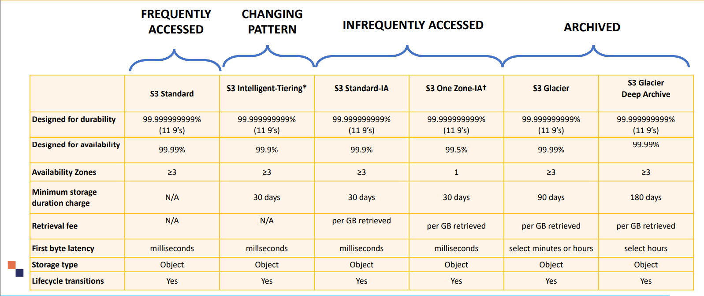

> [Home](../README.md)

# Table of Contents
- [Data Engineering Syllabus](#data-engineering-syllabus)
- [Data Migration to cloud.](#data-migration-to-cloud)
  * [AWS Data Migration Services (AWS DMS)](#aws-data-migration-services--aws-dms-)
  * [Streaming (Kineses)](#streaming)
- [Data Storages](#data-storages)
  * [AWS Storage Solution](#aws-storage-solution)
    + [Amazon S3](#amazon-s3)
    + [S3 for AWS Lake Formation (Data Lake Solution)](#s3-for-aws-lake-formation--data-lake-solution-)
    + [Amazon EBS volumes (Block Storage)](#amazon-ebs-volumes--block-storage-)
    + [Amazon Instance Store (Block Storage)](#amazon-instance-store--block-storage-)
    + [Amazon FSx for Lustre (File Share)](#amazon-fsx-for-lustre--file-share-)
    + [Amazon EFS (File Share)](#amazon-efs--file-share-)
    + [Amazon Elasticsearch](#amazon-elasticsearch)
    + [Amazon ELASTICACHE (In Memory)](#amazon-elasticache--in-memory-)
  * [AWS Database Solution](#aws-database-solution)
    + [AWS Redshift ( Data warehouse ) + Redshift Spectrum](#aws-redshift---data-warehouse-----redshift-spectrum)
    + [Amazon Dynamo DB](#amazon-dynamo-db)
    + [Aurora RDS](#aurora-rds)

# Data Engineering Syllabus

* Domain 1.1: Data Repositories for ML

* Domain 1.2: Identify and implement a data-ingestion solution

* Domain 1.3: Identify and implement a data-transformation solution

# Data Migration to cloud.
* See the presentation attached

* Static
    * AWS Direct Connect
    * Snowball
    * Snowmobile
    * AWS Database Migration Service (AWS DMS)
    * AWS Storage Gateway

* Real-Time/Streaming
    * Kinesis Set of solution
    * IoT Devices

## AWS Data Migration Services (AWS DMS)

* https://aws.amazon.com/dms/faqs/
* • As the name stated, AWS Database Migration Service allows for database migration to AWS quickly. 
* • Source database remains functional during migration. 
* • Oracle to oracle migration or oracle to Aurora (RDS).
* • Allows for database consolidation.
* • Allows for data replication in a Data warehouse such as Amazon Redshift and S3

## Streaming

* Check Presentation

* Amazon Kinesis Data Streams
  * https://aws.amazon.com/kinesis/data-streams/faqs/
  * Amazon Kinesis Data Streams (KDS)  is streaming service that works seamlessly in Realtime. Within 70 ms.
  * By default it stores data for 24 hours can be extended up to 7 days
  * You can ingest millions of data coming from various sources such as click streams, IOT, and several devices. 
  * Realtime analytics can be conducted on the data and displayed on a dashboard.
  * **Auto Scaling NOT SUPPORTED**. You have to manage the number of shards.
  * Shards
    * See presentation for shard number calculation
    * Default max shards can be 500 can be extended to inf.
  * Management and Interactions
    * KPL can incur an additional processing delay compared to AWS SDK API. 
    * For time sensitive applications, it is recommended to use AWS SDK directly.
    * **Kinesis Producer Library** : The KPL allows for data writing to a Kinesis Data Streams. 
    * **Kinesis Client Library** : The KCL allows for data consumption from Kinesis Data Streams. It acts as an intermediary between processing record code and Kinesis Data Streams. KCL handles the complex tasks of managing instances.
    * **Kinesis SDK API** : Kinesis Data Streams API allows for managing streams, re-sharding, and putting and getting records.
  
  
  
* Amazon Kinesis Data Firehose
  
  * https://aws.amazon.com/kinesis/data-firehose/faqs/
  * Amazon Kinesis Data Firehose allows for easy and cost effectively way to load streaming data into data lakes. 
  * Amazon kinesis firehose allows for near real-time analytics.
  * It automatically scales to match any throughput of data.
  * Data Transformation through AWS Lambda (CSV => JSON) and supports compression with Amazon S3 as destination.
  * **Support for built in on the fly conversion**
    * Amazon Kinesis Data Firehose can convert the format of incoming data from JSON to Parquet or ORC formats before storing the data in Amazon S3, so you can save storage and analytics costs.
  
  
  
* Amazon Kinesis Video Streams
  * https://aws.amazon.com/kinesis/video-streams/faqs/
  * Kinesis video streams is extremely elastic and automatically scales for any number of devices.
  * As always, pay per use model and data is kept for 1 hour and up to 10 years.
  * Kinesis video streams is secure since it durably encrypts the video streams and store it. 
    * KMS at rest
    * TLS in transit
  * Connect Kinesis video streams to OpenCV, Amazon Rekognition, Apache MXNet, TensorFlow. 
  * You can integrate with Kinesis video streams with AWS DeepLensand Realtime Streaming Protocol (RTSP) camera
  * Kinesis can extract metadata 
  
  
  
* Amazon Kinesis Data Analytics

  * https://aws.amazon.com/kinesis/data-analytics/faqs/
  * Amazon Kinesis data analytics run in Realtime and is fully automatically scalable based on incoming data throughput.
  * Available for SQL and JAVA developers:
    * SQL: Developers can query streaming data by leveraging readily available templates. There is also a SQL editor.
    * Java: Java Library includes over 25 pre-built operators, Developers can leverage open source Java libraries to perform data analysis in Real-time
  * **Real-Time Anomaly Detection**
    * **Random Cut Forest**: The function assigns anomaly score to each data record.
    * **Hot-Spots** : Locate to identify dense areas in the data
  * Neither Glue ETL nor Kinesis Analytics can convert to LibSVM format, and scikit-learn is not a distributed solution.

* **Apache spark (provisioned on AWS EMR) could be integrated with Amazon Kinesis and Apache Kafka to stream and analyse data in Realtime**

# Data Storages

## AWS Storage Solution
* There are 3 types of storages
    * Object Storage
      * S3
    * Block Storage 
      * EBS
      * Instance Store
    * FileShare 
      * EFS
      * FSXLuster
    
* Then there are databases
    * Relational
        * Amazon RDS
        * PostgreSQL
        * Amazon Aurora
        * MariaDB
        * MySQL
        * Oracle
    
    * NoSQL
        * DynamoDB
        * Cassandra
        * DocumentDB
    
    * Search database
        * ElasticSearch (Clickstream, logs, data indexing)

    * In-Memory
        * ELASTICACHE (Gaming,IOT,Healthcare Application)

    * Data Warehousing
        * Redshift 

    * Graph Database
        * Neptune
    
    * Timestream
        * Timeseries Database
    
    * Quantum Ledger
        * Ledger Database : Blockchain

### Amazon S3
* https://aws.amazon.com/s3/faqs/

* Features
    * Inf Capacity (each object size can be upto 5 TB)
    * Each bucket has unique global URI

* Tags
    * You can use object Tags (key value pairs) to categorize storage.
    * The maximum number of tags per object is 10.
    * Objects tags are important for: 
        * Granting or denying permission (for example: read only user access). 
        * Managing object lifecycle by creating a lifecycle rule based on associated tags. 
        * Performing analytics.
    
* Partitions
    * AWS S3 data partitioning is critical when querying data because it could dramatically reduce the cost required for scanning (For example Amazons Athena charges $5/TB scanned).
    * Partitions can be done based on dates(y/m/d) or business hierarchy (dept/product/etc)

* Tiers
    

* Lifecycle configuration
    * Lifecycles are managed via a lifecycle configuration file (XML file)
    * Two types of actions are present:
        * Transition Action: When to change class
        * Expiration Action: When to delete

* Security and Encryption
    * With server-side encryption, Amazon S3 encrypts an object before saving it to disk and decrypts it the object is downloaded.
    * Here are the options for encryption:
        * Amazon S3-managed keys (SSE-S3) – common with ML services
        * Customer master keys (CMKs) stored in AWS Key Management Service(AWS KMS). This allows for extra security – common with ML services. 
        * SSE-C: users can manage their own keys to perform data encryption.
        * Client side encryption

    * Macie: Macie is a security service to automatically find sensitive data and alert users for anomalies.

* Access:
    * Private by default
    * Allow access to other by creating two types of policies:
        * Resources Based: Only that particular resource in the bucket will be accessed. Bucket polices and Access Control List (ACL)
        * User Based: A particular roles/users will have access to the bucket. Identity and Access Management (IAM) polices
    * Both polices use JSON-based access policy language.
    * Block Public Access
        * Public access is blocked by default. **Block Public Access** settings can be configured for each bucket.
        * Amazon S3 block public settings overrides any created polices and permissions to block public access to resources/buckets

* Monitoring:
    * Amazon CloudWatch Alarms
        * • Used to send an alarm once a certain threshold is exceeded for multiple number of cycles. 
        * • The alarm is sent to AWS autoscaling policy.
    * AWS CloudTrail Logs
        * • CloudTrail is used to track activity made by users, roles, or on AWS service.
        * • CloudTrail provides a record of past requests, IP addresses, timing of the request…etc.
    * Amazon S3 Access Logs
        * • Access logs are important to ensure security and to conduct access audits. 
        * • Access logs are used to record/track requests made to buckets.
    * AWS Trusted Advisor
        * • Amazon offers trusted advisory service that makes recommendations on how to improve the systems performance and close any security gaps.
        * • Trusted Advisor provides the following:
            * Check that amazon S3 buckets have proper configuration.
            * Check amazon S3 buckets that have permissions set to “open access”. 
            * Checks Amazon S3 buckets that did not enable versioning.

* Network Security:
    * Amazon VPC: Allows users to create an AWS resources inside a virtual Network
    * A VPC endpoint will route requests to Amazon S3 and back to the VPC. 

### S3 for AWS Lake Formation (Data Lake Solution)
* https://aws.amazon.com/lake-formation/faqs/

* Data Lake
    * A data lake is a centralized repository for structured and unstructured data storage. 
    * Data lakes could be used to store raw data as is without any structure (schema). 
    * There is no need to perform any ETL or transformation jobs on it. 
    * You can store many types of data such images, text, files, videos. 
    * You can store machine learning models artefacts, real time data, and analytics outputs in data lakes.
    * Processing could be done on export so schema is defined on read.
    * Amazon S3 (as storage for a data lake)

* Amazon S3 offers a great, easy to use solution to create a data lake because its highly scalable.

* Amazon S3 works with common formats such as: CSV, Parquet, ORC, Avro, Protobuf and JSON.

* Required Features for a Data Lake Solution
    * COMPUTE AND DATA PROCESSING ARE DECOUPLED
    * CENTRALIZED DATA ARCHITECTURE
    * INTEGRATION WITH CLUSTERLESS/SERVERLESS AWS SERVICES
    * STANDARDIZED APIS

### Amazon EBS volumes (Block Storage)
* https://aws.amazon.com/ebs/faqs/
* EBS is a managed block storage service 
* Storage volume is outside of host  computer – Long term persistence 
* EC2 instance use EBS storage volume  as a block device 
* You need to pay for allocated EBS  storage

###  Amazon Instance Store (Block Storage)

Storage of host computer is  assigned to EC2 instance

Temporary Storage 

Highest Performance 

Storage included as part of  instance pricing

### Amazon FSx for Lustre (File Share)

* There is also FSx for Windows which is a File share for Windows EC2 instances on AWS

* https://aws.amazon.com/fsx/lustre/faqs/
* File share Optimized for High Performance  Computing – Linux EC2 instances Access S3 as a file share (like Storage Gateway)
* Use in ML when you want to perform multiple experiments on the same large dataset, so instead of copying from S3 again and again you use FSx and mount it as a storage for you EC2.

### Amazon EFS (File Share)
* https://aws.amazon.com/efs/faq/
* File share for Linux EC2 instances on AWS

### Amazon Elasticsearch 
* • Amazon Elasticsearch Service is a fully managed service that allows for 
Elasticsearch deployment easily and securely.
* • Amazon Elasticsearch is cost effective with zero upfront cost.
* • Elasticsearch could be used for clickstream analytics, data indexing. 

### Amazon ELASTICACHE (In Memory)
* • Amazon ELASTICACHE is an in-memory data store and cache.
* • Amazon ELASTICACHE is extremely fast and designed specifically for demanding applications that need sub-millisecond response times. 
* • Amazon ELASTICACHE is designed for Gaming, Internet of things, and Healthcare applications.
* • ELASTICACHE is used for data intensive apps by retrieving data from high throughput and low latency in-memory data stores.

## AWS Database Solution

### AWS Redshift ( Data warehouse ) + Redshift Spectrum
* https://aws.amazon.com/redshift/faqs/
* Amazon Redshift is the **fastest cloud data warehousing service** that could be used to perform business analytics
* Extremely fast and optimized performance since it **relies on columnar storage and data compression.**
* Queries are run against data stored in redshift storage or against data stored in S3.
* Redshift uses a unique data warehousing architecture that **relies on Massively Parallel Processing (MPP).**
* **MPP parallelize and distribute SQL operations.** 
* Redshift **uses machine learning to optimize performance.** 
* Data warehouse
    * A data warehouse exists on top of several databases and used for business intelligence.
    * Data warehouse consumes data from all these databases and creates a layer optimized to perform data analytics.
    * Schema is done on import.
* Features
    * Extremely fast and optimized performance since it relies on columnar storage and data compression.
    * Queries are run against data stored in redshift storage or against data stored in S3.
    * Redshift uses a unique data warehousing architecture that relies on Massively Parallel Processing (MPP).
    * MPP parallelize and distribute SQL operations. 
    * Redshift uses machine learning to optimize performance. 
* **Redshift Spectrum**
    * AWS Amazon Redshift Spectrum allows analysts to run SQL queries on data stored in Amazon S3 buckets directly. 
    * Redshift can dramatically save time because it does not require transferring data from S3 to a database. 
    * Redshift Spectrum can work well with unstructured S3 data lakes along with AWS Glue Catalogue.

### Amazon Dynamo DB
* It works great for storing machine learning models for inference by application
* Amazon DynamoDB is a fully managed NoSQL key-value and document database (not relational database so no schema is required).
* DynamoDB is extremely scalable with minimum latency: 
    * 10 trillion requests/day 
    * 20 million requests/second
* Create a new table for your application and let DynamoDB handle the rest.
* It works great for storing machine learning models for inference by application
* Watch Video: https://aws.amazon.com/dynamodb/

### Aurora RDS
* Amazon Aurora is a fully managed by Amazon Relational Database (RDS) service. 
* Transactional style database. 
* Engine Options
    * MySQL 
    * PostgreSQL
    * Amazon Aurora
    * Oracle
    * MariaDB
    * MS MySQL Server
* You do not have to deal with administration tasks such as hardware provisioning, creating 
backups and database setup.
* It features continuous backup to Amazon S3, and replication across three Availability Zones.
* Many engines available to create database

