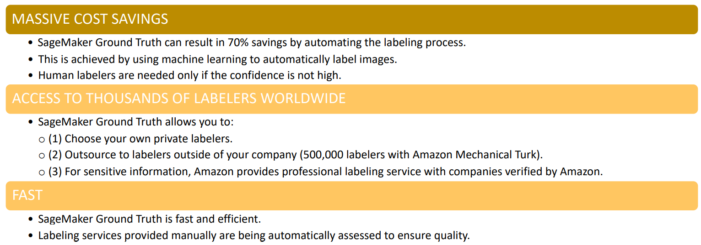

> [Home](../README.md)

# Table of Contents
- [Exploratory Data Analysis Syllabus](#exploratory-data-analysis-syllabus)
- [ETL](#etl)
  * [AWS Glue](#aws-glue)
  * [AWS Data Pipeline](#aws-data-pipeline)
  * [AWS Batch](#aws-batch)
  * [AWS Step Functions](#aws-step-functions)
  * [AWS Athena](#aws-athena)
  * [AWS EMR](#aws-emr)
  * [Apache Zeppelin](#apache-zeppelin)
- [EDA and Data Preparation Solutions](#eda-and-data-preparation-solutions)
  * [AWS QuickSight](#aws-quicksight)
  * [SageMaker Data Wrangler](#sagemaker-data-wrangler)
  * [SageMaker Ground Truth](#sagemaker-ground-truth)
- [EDA and Feature Engineering Techniques.](#eda-and-feature-engineering-techniques)
  * [EDA](#eda)
    + [Libraries](#libraries)
    + [Visualization](#visualization)
    + [Distributions](#distributions)
    + [Time Series](#time-series)
  * [Check for pretraining data bias](#check-for-pretraining-data-bias)
- [Data Staging](#data-staging)
  * [Shuffling](#shuffling)
  * [Unbalanced Datasets](#unbalanced-datasets)
  * [Imputation](#imputation)
  * [Outliers](#outliers)
- [Data Transformations](#data-transformations)
  * [Numerical To Numerical](#numerical-to-numerical)
    + [Scaling](#scaling)
      - [Normalization :](#normalization--)
      - [Standardization (for outliers):](#standardization--for-outliers--)
      - [Log Transform](#log-transform)
- [Data Encoding](#data-encoding)
  * [Numerical to Numerical](#numerical-to-numerical)
    + [Dimensionality Reduction](#dimensionality-reduction)
      - [PCA](#pca)
      - [T-SNE](#t-sne)
  * [Numerical To Categorical](#numerical-to-categorical)
    + [Binning](#binning)
  * [Categorical to Numerical](#categorical-to-numerical)
    + [One-Hot Encoding](#one-hot-encoding)
  * [Ordinal to Numerical](#ordinal-to-numerical)
  * [Cyclical Feature Encoding](#cyclical-feature-encoding)
  * [Date Time](#date-time)
  * [Feature Split](#feature-split)
  * [Text](#text)
    + [Tf-IDF](#tf-idf)
    + [Word Embeddings](#word-embeddings)
  * [Image](#image)

# Exploratory Data Analysis Syllabus

* Domain 2.1: Sanitize and prepare data for modelling

* Domain 2.2: Perform feature engineering

* Domain 2.3: Analyse and visualize data for ML

# ETL

## AWS Glue

* https://aws.amazon.com/glue/faqs/

* AWS Glue is a fully managed service that enable users to extract, transform, and load (ETL) data.

* Data generated by AWS Glue could be fed into analytics tools such as Amazon QuickSight.

* AWS Glue steps: 
  1. Setup AWS Glue and direct it to your stored data on AWS
  2. AWS Glue extracts metadata such as table definition and schema and put it in the AWS Glue Data Catalog. 
  3. Once catalogued, you can query the data and perform ETL

* Features:
  * SEAMLESS INTEGRATION WITH AWS SERVICES
    * • AWS Glue works seamlessly with other AWS services which allow for easy integration.
    * • AWS Glue works well with stored data in Redshift, S3, and databases in Virtual Private Cloud (VPC) running on EC2.
  * MINIMUM CONFIGURATION HASSLE AND OPTIMIZED COST
    * • AWS Glue offers pay per use service so no upfront cost or servers to manage.
    * • AWS Glue will take care of scaling and configuration in running the ETL jobs.
  * EASY TO USE 
    * • AWS Glue crawls data storages, extract data schemas and transformations. 
    * • AWS Glue generates data transformation codes on its own.

* Glue Steps:
  * **STEP 1: CREATE DATA CATALOG**
    * Setup a crawler to scan the S3 data periodically and generate Glue data catalogue
    * Crawlers are used to scan the stored data and infer schemas and partitions.
    * Schema is read based on the classifier (json,xml,csv, etc)
    * Crawlers can rely on partition structure to read data.
    * Athena and AWS Glue Data Catalog work seamlessly together, AWS Glue can be used to create databases and tables (schema) so that Athena can use it to query the data.
    * Once the AWS Glue data catalogue is available,Amazon Athena and Redshift can query the data and view in Quicksight
  * **STEP 2: GENERATE AND EDIT TRANSFORMATIONS**
    In **python/Scala programming languages**, AWS Glue generates ETL code to extract data from the source and transform it to match the target schema, and load it into the target. Users can then test the code in IDE/notebook.
    * Bundled Transformations
      *  DropFields Class
      *  DropNullFields Class
      *  Filter Class
      *  Join Class
      *  Map Class
      *  MapToCollection Class
      *  RenameField Class
      *  ResolveChoice Class            
    * ML Transformation
      * FindMatches ML: could be used to find matching data which enables you to find related products, customers, and places.
      * FindMatches ML could be used to find duplicate customers who have signed up more than once.        
  * **STEP 3: SCHEDULE AND RUN JOBS**
    * AWS Glue ETL jobs.
    * Amazon Athena.
  * **Limitations**
    * Neither Glue ETL nor Kinesis Analytics can convert to LibSVM format, and scikit-learn is not a distributed solution.
    * Glue cannot write the output in RecordIO-Protobuf format.

## AWS Data Pipeline

* https://aws.amazon.com/datapipeline/faqs/

* • AWS Data Pipeline is an orchestration service that allows AWS users to transfer data reliably and securely between various AWS compute and storage services.
* • You can transfer data to Amazon S3, Amazon RDS, Amazon DynamoDB, and Amazon EMR.
* • AWS manages the workflow so minimum maintenance is required. 
* • AWS guarantees resource availability and handles failures.

## AWS Batch

* https://aws.amazon.com/batch/faqs/

* • AWS Batch allows for running of batch computing jobs on AWS.
* • AWS batch optimizes the type and number of compute resources based on volume. 
* • No management or hassle (serverless), AWS takes care of the batch computing software and resources. 
* • AWS Batch performs all the scheduling and execution of the batch using Amazon EC2 and Spot Instances.
* • Users pay for the EC2 resources that the batch run on.
* • AWS Batch jobs could be scheduled using CloudWatch Events
* • AWS batch jobs could be orchestrates using AWS Step Functions

## AWS Step Functions

* https://aws.amazon.com/step-functions/faqs/
* • AWS Step Functions allows for creating serverless workflows.
* • Output from a step is fed as an input to the next step.
* • AWS Step functions converts a workflow into a state machine diagram that’s easy to debug and understand. 
* • AWS Step Functions allows for performing resilient workflow automation fast without writing code. 
* • It allows for advanced error handling and retrying mechanisms.

## AWS Athena

* https://aws.amazon.com/athena/faqs/?nc=sn&loc=6
* Features
  * Amazon Athena is used for data analysis simply by accessing the data available in Amazon S3 using standard SQL requests. (Amazon Athena uses Presto with ANSI SQL support.)
  * **Athena eliminates the need to have complex and expensive ETL jobs to analyse your data.**
  * Athena is serverless which makes it extremely easy to use.
  * **Athena is easily integrated with AWS Glue data catalogue**.
  * Athena supports several formats such as 
    * CSV
    * JSON
    * ORC
    * Avro
    * Parquet
* Security
  * AWS Identity and Access Management (IAM) policies
  * Access control lists (ACLs) 
  * Amazon S3 bucket policies
  * Transport Layer Security (TLS) encrypts in transit data between Athena and Amazon S3.
* Pricing
  * Users are charged $5 per terabyte scanned.
* Glue + Athena
* Athena vs Redshift Spectrum

## AWS EMR

* https://aws.amazon.com/emr/faqs/

EMR Stands for Elastic Map Reduce

* Features
  * Leverages Apache Spark, Apache Hive, Apache HBase, Apache Flink, and Presto.
  * Using Jupyter-based EMR Notebooks, developers can work with data anywhere in AWS such as Amazon S3, Amazon DynamoDB, and Amazon Redshift.
  * Works great with machine learning, data transformations (ETL), and deep learning.

* EMR Cluster Architecture
  * Master Node : Distribute data and tasks. Tracks status of tasks and monitors health cluster.
  * Core Node (Slave Node) : Runs tasks and store data in the Hadoop Distributed File System (HDFS) on the cluster.
  * Task Node (Optional Slave Node) : It only run tasks. It makes use of AWS Spot Instances. No risk of data loss if task node is removed.

* EMR Data Storage

  * **EMRFS**: Mostly this is used to read/write file to and from S3. EMRFS Consistent View (a separate paid service) uses DynamoDB store metadata in order to ensure data consistency
  * HDFS
  * S3 block file system
  * local

* Glue vs EMR

  * AWS GLUE:•Glue is an ETL service that runs on a serverless Apache Spark environment. •As a user, you do not have to configure or manage resources. •Glue contains a data catalogue for ETL that could be used with Athena and Redshift Spectrum.•AWS Glue ETL jobs uses Scala or Python. 
  * AWS EMR:•Amazon EMR allows for direct access to Hadoop environment.•Amazon EMR allows for flexible, lower-level access to tools beyond Spark.

* EMR vs Athena vs Redshift 

  * Redshift: •Data warehousing services•Offers fastest query performance for enterprise reporting and business intelligence workloads•Can be used with extremely complex SQL with several sub-queries
  * EMR: •Sophisticated data processing framework•Allows for running highly distributed processing frameworks such as Hadoop, Spark, and Presto in a simple and cost effective ways. •Offers large flexibility, users are able to specify memory, compute and storage requirements to meet their specific needs. 
  * Athena: •Query service•Provides easiest way to run ad-hoc serverless queries for data available in S3 buckets.•There is absolutely no need to manage any servers.

* Streaming: **Amazon EMR can be used for this use case, but it generally doesn’t satisfy the minimally managed requirement.**
* Apache Hadoop with EMR Use Cases
* **CLICKSTREAMS DATA ANALYTICS**
  
  * Hadoop is used for clickstreams data analytics to track customers behaviour (targeted ad campaign).
  * **LOG DATA ANALYSIS**
  
  * Hadoop is used for log data analysis by converting petabytes of un-structured data into key metrics/insights.
  * **MASSIVE DATA PROCESSING**
  
  * Hive application can allow for massive scale data analytics by leveraging MapReduce using a SQL interface.
  * **ETL JOBS**
  
  * Hadoop works great for ETL jobs such as sorting, joining, and aggregating big data.

* Apache Spark with EMR

  * **Apache spark could be integrated with Amazon Kinesis and Apache Kafka to stream and analyse data in Realtime**
  * Results could be stored to Amazon S3 or on-cluster HDFS
  * Apache Spark includes several libraries such as machine learning (MLlib), stream processing (Spark Streaming), and graph processing (GraphX)

## Apache Zeppelin

* Apache Zeppelin is a web-based notebook that allows for interactive data analytics and collaborative documents with SQL, Scala.
* Apache Zeppelin could be used for data exploration by creating interactive notebooks using Apache Spark.
* Zeppelin could be used as well with deep learning frameworks like Apache MXNet with Spark applications.

# EDA and Data Preparation Solutions

## AWS QuickSight

* https://aws.amazon.com/quicksight/resources/faqs/
* **Amazon QuickSight can only be used with structured datasets that need to be stored in Amazon S3 or a database**  not with streaming data directly.
* Amazon QuickSight is cloud business intelligence (BI) tool that is used to visually share data across the entire organization.
* Integration
  * Amazon Redshift
  * Athena
  * S3 or on-premises files in the following formats:
    * Excel
    * CSV
    * TSV
  * EC2-hosted databases
  * Aurora/RDS
* Spice : SPICE is a fast, optimize, in-memory calculation engine for Amazon QuickSight.
* Embedded Analytics
  * Allows for creating amazing, modern dashboards that uses QuickSight’s visualization and analytics capabilities(ML Insights) and Auto-Narratives
* ML Insights
  * Anomaly detection tool.
  * Forecasting
  * Generate Auto-Narratives : Powered by NLP auto-story telling.
* Pricing
  * No annual subscription and zero upfront costs Charges are applied only when users access dashboards or reports
* Security
* 

## SageMaker Data Wrangler

* New offering by AWS use to perform EDA within SageMaker Console

## SageMaker Ground Truth

Purpose : Create labelled data for supervised learning

Features

Pricing

*  The pricing model is per object. 
*  It does not matter if the object is labelled automatically or manually. 
*  Additional cost is paid with Amazon Mechanical Turk. 
*  The cost differs based on the workflow: (1) classification, (2) bounding box, (3) semantic

# EDA and Feature Engineering Techniques.

## EDA

### Libraries
  * Numpy
  * Pandas

### Visualization
* Libraries
  * Matplotlib
  * Seaborn

* Plots and Charts
  * Scatterplots
    * Scatterplot demonstrates the relationship between two variables (X, Y)
  * Bubble Charts
    * Bubble chart demonstrates the relationship between three variables  (X, Y, Bubble Size)
  * Bar Charts
    * Comparison
  * Line Charts
    * Comparison and trend analysis.
  * Histograms
    * Distribution analysis.
  * Box Plots
    * Distribution analysis and outlier detection.
  * Compositions
    * Pie
    * Stacked Bar
    * Stacked Area

### Distributions
* Normal Distribution
* Standard Normal Distribution
* Possions Distribution
* Binomial Distribution
* Bernoulli Distribution

### Time Series
* Feature of a time series
  * Level
  * Trend
  * Seasonality
  * Noise

* Types of Models
  * Multiplicative
  * Additive

## Check for pretraining data bias

* [Measure Pretraining Bias - Amazon SageMaker](https://docs.aws.amazon.com/sagemaker/latest/dg/clarify-measure-data-bias.html)

# Data Staging

* This step ensures we are preparing the dataset before performing transformation and encoding.

## Shuffling

* This is important to avoid any bias or pattern related to the order of the data.
* Perform this before splitting your dataset into train, test, validation.
* Important to carry out shuffling in case of linear regressors
* Shuffling ensures:
  * Enhanced ML model quality/performance
  * Reduce tendency to overfit the training data

## Unbalanced Datasets
* Reference Links:
  * [Learning from Imbalanced Classes - Silicon Valley Data Science (svds.com)](http://www.svds.com/learning-imbalanced-classes/)
* Try to balance the dataset in some way:
  * Generate Synthetic Datasets: Create synthetic dataset from minority class which depends on oversampling parameters provided.
    * SMOTE: Create new minority examples by interpolating between existing ones.
      * Step 1: Ignore Majority Class
      * Step 2: For every minority class choose k nearest neighbours
      * Step 3: Create new instances halfway between the first and neighbours
  * Under sampling: Drop samples from the majority class. (**This approach essentially requires throwing away data, which is definitely not a good solution given the small dataset in this question.**)
  * Oversampling: Duplicate samples from minority class.
* Choose appropriate evaluation methods:
  * Don’t use accuracy (or error rate) to evaluate your classifier! Use the following metrics instead.
    * ROC-AUC: It is equal to the probability that a random positive example will be ranked above a random negative example.
    * F1 Score :  harmonic mean of precision and recall.
    * Cohen Kappa: evaluation statistic that takes into account how much agreement would be expected by chance.
  * Get probability estimates instead of hard labels
    *  Don’t blindly use a 0.50 decision threshold to separate classes
  * Adjust weight class: Treat minority class as more important. 
  * No matter what you do for training, always test on the natural (stratified) distribution your classifier is going to operate upon. See `sklearn.cross_validation.StratifiedKFold`.
  * You can get by without probability estimates, but if you need them, use calibration (see `sklearn.calibration.CalibratedClassifierCV`)
* **Treat problem as anomaly detection instead of classification**: Throw away minority examples and switch to an anomaly detection framework.
* Finally you can always buy more data.

## Imputation
* Dropping : For features with very sparse records.
* Numerical Imputation
  * Median : If outliers are present then replace with median
  * Mean: For selected feature create a group for feature value and replace.
  * Custom model
* Categorical Imputation:
  * Create a model to perform KNN
* Time Series
  * AWS DeepAR uses RNN model to perform imputation

## Outliers
* Detection Techniques:

  * Statistical Tests:
    
    * Variance and Standard Deviation
  * Visualization:
    * Box Plots and percentiles
* Mitigation Techniques.
* **AWS Random Cut Forest Algorithm is used in services like AWS Kineses an QuickSight to detect outliers.**

# Data Transformations
* Data Transformation is when we continue to use the same feature after applying transformations
* No new features are created here.

## Numerical To Numerical

### Scaling

* Criteria to consider while choosing technique:
  * Which algorithms benefit from scaling:
    * PCA, SVM, KNN, MLP(Neural Network), distance based regressors and classifiers.
  * **Algorithms which DO NOT benefit from scaling**
    * **XGBoost, Random Forest, Decision Trees.**
  * If outliers are concern use Standardization (z-score) if not then Normalization would be sufficient.
  * [Normalization vs Scaling](https://towardsdatascience.com/normalization-vs-standardization-quantitative-analysis-a91e8a79cebf)
  * [Compare the effect of different scalers on data with outliers — scikit-learn 0.24.2 documentation](https://scikit-learn.org/stable/auto_examples/preprocessing/plot_all_scaling.html#sphx-glr-auto-examples-preprocessing-plot-all-scaling-py)

#### Normalization : 

* Possible use-cases
  * 

* **MaxAbsScaler**: Always between range 0,1. The max value is mapped to 1 and rest of the values are scaled proportionately.

  

* **MinMaxScaler**: Perform normalization operation so that feature value ranges from [0,1] (however there is no guarantee that the largest value will be 1)

  

* Remember that sklearn has a **Normalizer** function that performs row normalizations 

#### Standardization (for outliers): 

* **StandardScaler** : Performs normalization and scaling. It removes the mean and scales data to unit variance
* Possible use-cases
  * Slow model Convergence
  * Model having large weights causing degradation in model performance.

• Standardization is conducted to transform the data to have a mean of zero and standard deviation of 1.

• Standardization is also known as Z-score normalization.

• **Standardization is preferred over normalization when there are a lot of outliers.** however it  cannot guarantee balanced feature scales in the presence of outliers.

• You can revert back to the original data range by applying inverse standardization.

* You can also get rid of outliers using random cut forest

#### Log Transform

* Log transform is used when the variables span many orders of magnitude such as “income”

# Data Encoding

* Data Encoding is when we use the newly generated encodings of the feature(s).
* New features are created here.
* Encoding can be done for  a single feature, set of feature, or entire dataset.

## Numerical to Numerical

### Dimensionality Reduction

#### PCA
* [PCA](https://docs.aws.amazon.com/sagemaker/latest/dg/pca.html)
* It is an unsupervised dimensionality reduction algorithm. 
* The algorithm calculates the covariance matrix (or an approximation thereof in a distributed manner), and then performs the singular value decomposition on this summary to produce the principal components.

*  They are also constrained so that the first component accounts for the largest possible variability in the data, the second component the second most variability, and so on.
* In Amazon SageMaker, PCA operates in two modes, depending on the scenario:
  - **regular**: For datasets with sparse data and a moderate number of observations and features.
  - **randomized**: For datasets with both a large number of observations and features. This mode uses an approximation algorithm.
*  PCA uses tabular data.
* Required Hyperparameters:
  * **feature_dim**: Input dimension.
  * **mini_batch_size**: Number of rows in a mini-batch.
  * **num_components**: The number of principal components to compute.
* Optional Hyperparamters
  * **algorithm_mode**(optional): regular or randomized
* PCA tries to preserve the Global Structure of data i.e when converting d-dimensional data to d’-dimensional data then it tries to map all the clusters as a whole due to which local structures might get lost.
*  **Application of this technique** includes Noise filtering, feature extractions, stock market predictions, and gene data analysis.

#### T-SNE

* It embeds the points from a higher dimension to a lower dimension trying to preserve the neighborhood of that point.
* Unlike PCA it tries to preserve the Local structure of data by minimizing the **Kullback–Leibler divergence (KL divergence)** between the two distributions with respect to the locations of the points in the map.
* This technique finds application in computer security research, music analysis, cancer research, bioinformatics, and biomedical signal processing.
* 

* Just in case remember that you can always choose to drop the feature if there is no correlation between the feature and the target variable directly or by using regularization techniques like L1 regularization. (L2 regularization will not drop the feature)

## Numerical To Categorical

### Binning
Create bins to transform feature values to categories. It can be combined with encoding

* Benefit :

  

  * Model performance.
  * Avoid overfitting: One of the key advantages of binning is to improve the model robustness and avoid overfitting.

* Types: 
  * numerical to categorical.
  * categorical to categorical.
  * quantile binning : 
    * Quantile Binning: works by assigning same number of observations to each of  the bins so each bin will end up having the same number of observations
    * This is useful when data spans orders of magnitude and there are large gaps between the linear bins as is the case when there are outliers present.

## Categorical to Numerical

### One-Hot Encoding

Be careful while dealing with ordinal data. While dealing with ordinal data you can map each metric with different values and finally chose the values that seems to be performing well

## Ordinal to Numerical
* Convert ordinal values like t-shirt size measurement into numerical features like 0,1,2

## Cyclical Feature Encoding

## Date Time
* Encode the data using sine and cosine functions.

* Tree based algorithms **WON'T BENEFIT** from it.
  * XGBoost
  * Random Forest
  * Decision Trees

## Feature Split

Split one feature into more.

## Text

### Tf-IDF
* Tf-Idf : TF-IDF is used to find important keywords in corpus of documents and to ignore less important (more frequent) words.
N-GRAM

* n-gram

* punctuation and stopwords

* extract dates

* Orthogonal Sparse Bigrams : OSB is used for text transformation by encoding the words in a text along with how many words have been skipped as well (distance between words)
  * it is an alternative to bi-gram transformation.

* Cartesian Product: Cartesian transformation works by creating permutations between variables.

### Word Embeddings
* Word2Vec

## Image

