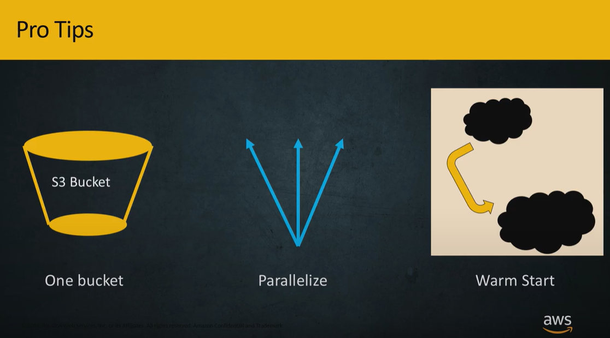

[Home](../README.md)

# Table of Content
- [Modeling Syllabus](#modeling-syllabus)
  * [Neural Network and ML Refresher](#neural-network-and-ml-refresher)
  * [Important Hyperparameters in Deep Learning](#important-hyperparameters-in-deep-learning)
    + [Initialization Techniques](#initialization-techniques)
    + [Optimizers](#optimizers)
    + [Activation Functions](#activation-functions)
      - [Final Activation Function for different problem types](#final-activation-function-for-different-problem-types)
      - [More on Activation Functions](#more-on-activation-functions)
  * [Common Problems and Solutions](#common-problems-and-solutions)
    + [Overfitting and Under fitting](#overfitting-and-under-fitting)
    + [Not Converging?](#not-converging-)
    + [Other Concepts](#other-concepts)
- [Data](#data)
- [Compute](#compute)
  * [EC2](#ec2)
  * [ECR/EKS/ECS](#ecr-eks-ecs)
    + [Spot Instances:](#spot-instances-)
  * [Lambda](#lambda)
- [Environment](#environment)
- [AWS ML Services](#aws-ml-services)
  * [Amazon SageMaker Ground Truth](#amazon-sagemaker-ground-truth)
  * [Amazon SageMaker](#amazon-sagemaker)
    + [Auto-ML](#auto-ml)
    + [Built-In Algorithms](#built-in-algorithms)
      - [Supervised](#supervised)
        * [Regression and Classification](#regression-and-classification)
          + [XG-Boost](#xg-boost)
          + [Factorization Machines](#factorization-machines)
          + [K-Nearest Neighbours (KNN)](#k-nearest-neighbours--knn-)
          + [SageMaker Linear Learner](#sagemaker-linear-learner)
        * [Time Series](#time-series)
          + [SageMaker DeepAR](#sagemaker-deepar)
      - [Unsupervised](#unsupervised)
        * [Feature Engineering and Dimensionality Reduction](#feature-engineering-and-dimensionality-reduction)
          + [Principal Component Analysis (PCA)](#principal-component-analysis--pca-)
        * [Anomaly Detection](#anomaly-detection)
          + [Random Cut Forest](#random-cut-forest)
        * [IP Anomaly Detection](#ip-anomaly-detection)
          + [IP Insights](#ip-insights)
        * [Object Embeddings High to low dim](#object-embeddings-high-to-low-dim)
          + [Object2Vec](#object2vec)
        * [Clustering or Grouping](#clustering-or-grouping)
          + [K Means](#k-means)
        * [Topic Modelling](#topic-modelling)
          + [Neural Topic Model](#neural-topic-model)
          + [LDA](#lda)
      - [Images](#images)
        * [Object Detection](#object-detection)
        * [Image Classification](#image-classification)
        * [Semantic Segmentation](#semantic-segmentation)
      - [Textual Analysis](#textual-analysis)
        * [Machine Translation, Text Summarization, Speech-to-text](#machine-translation--text-summarization--speech-to-text)
          + [SageMaker Seq2Seq](#sagemaker-seq2seq)
        * [Text Classification](#text-classification)
          + [SageMaker Blazing Text](#sagemaker-blazing-text)
      - [Reinforcement Learning](#reinforcement-learning)
    + [Experiments](#experiments)
    + [Built In Model Training](#built-in-model-training)
    + [Automatic Model Tuning (Hyper-Parameter Optimization)](#automatic-model-tuning--hyper-parameter-optimization-)
    + [Distributed Training](#distributed-training)
      - [SageMaker and Spark](#sagemaker-and-spark)
    + [Fairness](#fairness)
    + [Explainability](#explainability)
    + [Incremental Training](#incremental-training)
    + [Checkpoint](#checkpoint)
    + [Use augment Manifest file](#use-augment-manifest-file)
    + [Monitor and Analyze Metrics](#monitor-and-analyze-metrics)
- [AWS AI Services](#aws-ai-services)
  * [ReKognition](#rekognition)
  * [Amazon Comprehend and Comprehend Medical](#amazon-comprehend-and-comprehend-medical)
  * [Translate](#translate)
  * [Transcribe](#transcribe)
  * [Polly](#polly)
  * [Forecast](#forecast)
  * [Lex](#lex)
  * [Personalize](#personalize)
  * [Textract](#textract)
- [Learn ML](#learn-ml)
  * [AWS DeepLens](#aws-deeplens)
  * [AWS DeepRacer](#aws-deepracer)
  * [AWS Deep Composer](#aws-deep-composer)
- [Additional Resources](#additional-resources)

# Modeling Syllabus

* Domain 3.1: Frame business problems as ML problems

* Domain 3.2: Select the appropriate model(s) for a given ML problem

* Domain 3.3: Train ML models

* Domain 3.4 Perform hyperparameter optimization

* Domain 3.5 Evaluate ML models

## Neural Network and ML Refresher

* Artificial Neural Networks Basics: Single Neuron Model
* Activation Functions
* Multi-Layer Perceptron Model
* How do Artificial Neural Networks Train?
* ANN Parameters Tuning – Learning rate and batch size
* Tensorflow playground

## Important Hyperparameters in Deep Learning

### Initialization Techniques

* **Xavier** 
  *  It is used to initialize weights of neural network. **helps reduce vanishing gradient problem**.
  * If weights at the start are small, then signals reaching the end will be too tiny.
  * If weights at the start are too large, signals reaching the end will be too large.
  * Weights from Xavier’s init are drawn from the Gaussian distribution.

### Optimizers

* **Adam** :
    *  Adam stands for adaptive momentum which can help the model converge faster and get out of being stuck in local minima
    * **It is the best optimizer among the rest.**
* **AdaDelta**:
    * Fastest amongst the rest
    * Useful in case of sparse data
* **Adagrad**:
    * Adagrad is an algorithm for gradient-based optimization that adapts the learning rate to the parameters by performing smaller updates and, in turn, helps with convergence.
    * Useful in case of sparse data.
* **SGD**
    * Stochastic gradient descent (SGD). Its is faster than simple gradient descent.
    * **Can only be used in shallow network**
* **RMSProp**
    * RMSProp uses a moving average of squared gradients to normalize the gradient itself, which helps with faster convergence.
* **Mini Batch Stochastic Gradient Descent (MB-SGD)**
    * Mini batch gradient descent will suffer from some of the same problems as SGD.

### Activation Functions

#### Final Activation Function for different problem types

#### More on Activation Functions

* Binary Step

  * a threshold based classifier
  * Use-Cases
    * As output layer in binary classifier.(not useful in multi-class classification)
  * Limitations:
    * Since the gradient of the function is zero, the weights and biases don’t update.

* Linear

  * activation is proportional to the input.
  * Use-Cases
    * 
  * Limitations:
    * Although the gradient here does not become zero, but it is a constant which does not depend upon the input value x at all. This implies that the weights and biases will be updated during the backpropagation process but the updating factor would be the same.
    * In this scenario, the neural network will not really improve the error since the gradient is the same for every iteration.

* Sigmoid

  *  Sigmoid transforms the values between the range 0 and 1
  * Use-Cases
    * Probability 
  * Limitations:
    * graph gets much flatter in other regions, stopping learning from happening
    * Not symmetrical around 0. This is solved by tanh

* Tanh

  * Ranges from -1,1

* ReLU

  

* Leaky ReLU

  * 
  * Stopping neurons of a region from becoming dead

* Parameterised ReLU

  * 
  * Adds the slope **a** as a hyper-parameter

* Exponential Linear Unit

  * Use-Cases
    * 
  * Limitations:
    * 

* Swish

  * Use-Cases
    * 
  * Limitations:
    * 

* Softmax

  * Use-Cases
    * 
  * Limitations:
    * 

  

## Common Problems and Solutions

### Overfitting and Under fitting

* How to overcome overfitting?
  
    * PERFORM EARLY STOPPING
    •Stop training when you notice that the validation loss increases while training loss decreases. 
    
    * DO REGULARIZATION
        Regularization improves the model generalization capability.
        * L1 : Lasso Regression : Instead of using Least square, we add add an error term to it, 
            Relies on the value of `alpha` and `slope`. (Like the more aggressive older brother from godfather movie)
        * L2 : Ridge Regression : Relies on the value of `alpha` and `slope^2`. (More calm and level headed brother "Michael" from the godfather movie)
      
    
    
    * ADD MORE DATASET 
    •By increasing the size of the dataset, the model might generalize more.
    * PERFORM FEATURE SELECTION 
    •Dropping useless features could improve the model generalization capability.
    * USE BOOSTING AND BAGGING (ENSEMBLE LEARNING) 
    •By combining voting from many different models via bagging and boosting, this will improve model generalization
    * ADD MORE NOISE
    •Adding noise might enable model to become more general 
    * USE DROPOUT TECHNIQUE
    •In Artificial Neural Network training, dropping some neurons using Dropout technique improves networks generalization ability.
    * SIMPLIFY MODEL ARCHITECTURE

### Not Converging?

* **Batch normalization** is a technique for training very deep neural networks that standardizes the inputs to a layer for each mini-batch. This has the effect of stabilizing the learning process and dramatically reducing the number of training epochs required to train deep networks.
* **Use Optimizers mentioned above:** 
* 

### Other Concepts

*  Bias Variance Trade-off

*  L1 Regularization

*  L2 Regularization : Also called weight decay/Ridge Regression

*  Artificial Neural Networks Architectures

*  Convolutional Neural Networks

*  Recurrent Neural Networks 

*  Vanishing Gradient Problem

*  LSTM Networks

*  Model Performance Assessment – Confusion Matrix

*  Model Performance Assessment – Precision, recall, F1-score

*  Model Performance Assessment – ROC, AUC, Heatmap, and RMSE

*  K-Fold Cross validation

*  Transfer Learning 

*  Ensemble Learning – Bagging and Boosting

# Data
* Use S3 services to store training/testing data and also to store model.

* Pipe Mode vs File Mode

  

# Compute

## EC2
* For simple use-cases CPU will be sufficient

* For deep learning (See Accelerated Computing Section of instance-type)
    * P3: 8 Tesla V100 GPU’s 
    * P2: 16 K80 GPU’s 
    * G3: 4 M60 GPU’s (all Nvidia chips)
    * AWS EMR

## ECR/EKS/ECS

### Spot Instances:
* These are spare instances available with aws that can be used at cheaper rate.
* They can take it back within 2 min of notifying you.
* You can choose to hibernate your workload and then restart the workload once the spot is available again or you can transfer your workload to a different compute instance.
* Unless your training job will complete quickly, we recommend you use checkpointing with managed spot training. SageMaker built-in algorithms and marketplace algorithms that do not checkpoint are currently limited to a MaxWaitTimeInSeconds of 3600 seconds (60 minutes).

## Lambda

Can be used for short compute requirements. Not to be run for more than 15 minutes

# Environment

* AWS Deep Learning AMIs: Pre-configured environments to quickly build deep learning applications

* Docker Container Image: 
  https://docs.aws.amazon.com/sagemaker/latest/dg/docker-containers.html
  
  * Prebuilt(Curated):

  * Custom
    * You have to create a container image of your own code (BYOC or Bring Your Own Container)
    * **Amazon SageMaker’s pre-built containers do not include a container supporting code written in R**

# AWS ML Services

## Amazon SageMaker Ground Truth

## Amazon SageMaker
* https://aws.amazon.com/sagemaker/faqs/

### Auto-ML

### Built-In Algorithms

[Summary of all algorithms](Sagemaker%20Inbuilt%20Algorithm%20Overview.xlsx)

#### Supervised

##### Regression and Classification
###### XG-Boost
###### Factorization Machines
* Example Cases:
  * Used to perform regression and classification if the data is sparse. 
  * Eg Click Prediction, Item Recommendation system when data is sparse.
  * Predict the behaviour of customers with an ad is placed by tracking the number/rate of clicks patterns.

* Data
  * Don't use csv, since data is sparse. We'll endup havning lots of commas
  * RecordIO/protobuf with float32

###### K-Nearest Neighbours (KNN)
* Use-Cases:
  * Classification:
  * Regression: returns the average of the knn cluster

###### SageMaker Linear Learner
* Imp points
  * Shuffling and Normalization are important to perform

##### Time Series
###### SageMaker DeepAR

#### Unsupervised

##### Feature Engineering and Dimensionality Reduction
###### Principal Component Analysis (PCA)
* See PCA section in [eda.md](../Domain_2/eda.md)

##### Anomaly Detection
###### Random Cut Forest

##### IP Anomaly Detection
###### IP Insights

##### Object Embeddings High to low dim
###### Object2Vec

##### Clustering or Grouping
###### K Means

* Specify number of clusters: k
* Specify if you want extra clusters : x (extra center factor)
* When training starts the total clusters will be: K = k * x, and over time these clusters will be reduced using Lloyds methods to k clusters.
* two ways of setting cluster centers
  * random
  * kmeans++ : This will set the initials clusters as far apart as possible and then bring them closer
* If choosing elblow method
  * plot the within cluster sum of squares as a function of k to determine optimum number of clusters.
  * mini_batch_size

##### Topic Modelling
###### Neural Topic Model

###### LDA

#### Images
##### Object Detection

* Data
    * Raw Data     
      * File Mode
        * RecordIO (application/x-recordio) (for file mode)
        * Image (image/png, image/jpeg, and application/x-image)      
      * Pipe Mode
        * RecordIO (application/x-recordio) (for file mode)
    * Additional Data
      * File
      * Image Size
      * Annotations
      * Categories

* Hyperparameters

  

* Compute  
  * Training

    

  * Inference

    

##### Image Classification

  * Data

  * Hyperparameters

  * Compute
    * Training
    
    * Inference
    
      

##### Semantic Segmentation
  * Data

  * Hyperparameters

  * Compute
    
    * Training
    
    * Inference

#### Textual Analysis
##### Machine Translation, Text Summarization, Speech-to-text
###### SageMaker Seq2Seq

##### Text Classification
###### SageMaker Blazing Text
* Each line of the input file contains a training sentence per line, along with their labels. Labels must be prefixed with __label__, and the tokens within the sentence - including punctuation - should be space separated.

#### Reinforcement Learning

### Experiments

* There are 3 ways of managing environment to run your experiments
  * Built In algorithms
    * Each algorithm points to a aws managed docker image in the global ECR and this image is used to setup the environment 
    * The training script along with any other dependencies is also managed by aws.
  * Script Mode
    * Create your training script and choose from available docker images
    * **Amazon SageMaker’s pre-built containers do not include a container supporting code written in R**
    * 
  * Bring your own container
    * Create a docker file
    
    * Create training script
    
    * SageMaker within the container will read from **/opt/ml** directory only by default 
    
    * 
    
    * 
    
      
    
    * Your script should write the model generated by your algorithm to the `/opt/ml/model/` directory. 
    
    * Structure of a Training Container
    
    * 
    
    * 
    
    * Docker File Structure
    
      * nginx.conf file contains configuration while deploying file on the server
    
      * predictor.py its a flask webserver that is used to make inferences during runtime
    
      * server/ : The program in this will be launched when the container is started for hosting, That file just launches the G Unicorn's server, which runs multiple instances of a flask application that is defined in your predictor.py script.
    
      * The train directory contains the program that's invoked when you run the container for training.
    
        So to implement your own training algorithm, you would modify the program that lives in there.
    
    * 
    
    * 
    
      
  
* Training Jobs

  * If your training job fails

    * Call the ***DescribeJob*** API to check the FailureReason option.
  * Go to Amazon CloudWatch logs and check the logs for the given training job.
    * You cannot log into an Amazon SageMaker training job instance because it is provisioned only temporarily and is destroyed later.
    * The Amazon SageMaker console doesn't give you insight into what happens with a specific training job.

  * Your initial notebook instance on aws. (In place of this you can have your own laptop. You don't need to use the notebook instance in sagemaker.)

    * Step 1 : Define your experiment script here. 
    * Step 2.1  : Call model.fit()
  
     
  
    
  
    * Step 2.2 : Once model.fit() is called
  
      * Data (along with training script) get uploaded to s3 bucket (this is from your local machine to s3)
  
      * Temporary EC2 instances are provisioned
  
      * Environment is setup by pulling image from ECR on these EC2 clusters
  
      * Data (that you just uploaded to s3) gets copied to these newly provisioned EC2 instances. (Using Pipe Mode, you can choose to stream your data directly to training instead of having to copy it first. Or instead of choosing entire dataset to copy, you can use distributed training, see below for more on it. )
  
      * Training jobs are run
  
      * After training finishes, Model Artifacts are copied back into s3 bucket
  
      * Clusters are shut down (scaled down)
  
        
  
        
      
        

### Built In Model Training

### Automatic Model Tuning (Hyper-Parameter Optimization)

https://www.youtube.com/watch?v=Xph2ajPEDPQ&list=PLhr1KZpdzukcOr_6j_zmSrvYnLUtgqsZz&index=4

* Which Algorithms

  * You can choose from one of the 17 built in algorithms
  * You can create your own docker container algorithm scripts and other dependencies, register in ECR and bring this while training.
  * Execute your script in script mode
  * 
  * 

* How to setup 

  * define objective metric
  * which hyperparameters
  * how many jobs in parallel and how many jobs in total

  

* How instances are setup

  * ROUND 1 

    The number of EC2 instances is defined by number of parallel jobs parameter while defining your tuner and the number of rounds are defined by max job parameter. Each parallel job will have different hyper-parameter settings

* ROUND 2: 

  The Bayesian Optimizers (there is only one other method, Random Search to progress to next step) learns from the previous jobs to increase or decrease the previous hyper-parameter setting and then starts with next round.

  

  ​	OR (Instead of using Random Search )

  

  

* Experiment Workflow

  * Get execution role

  * create session

  * Data

    * get default s3 bucket

    * create a partition (folder) in the s3 bucket with the name of your experiment. This folder will contain

      * Setup training  and validation data paths (location) in s3 and upload data to it. 

        

      * Setup Channels to the path

      * The concept of channels is the same as the concept of "Datastores" in azure. The data resides in the storage solution (s3 in most cases) and channels are the logical path to your data. Only during training,vaidation, testing and for storing model artifacts do we requires to have access to them.

        

      * Setup output folder path
      
        

  * Environment
  
    * prepare your training container image. You have 2 options
      * Pull prebuilt images : If you choose one of the inbuilt algorithms each will have its own pre-built image that it comes along with. 
      * Custom image : Create custom docker image (it must contain your experiment script and other dependencies) . Then you must register it in  ECR. BYOC (Bring your own container)

  * Setup Sagemaker client session

    

  * Setup Hyper-parameter Experiment

    * Setup Overall Experiment Configuration File
  
      * Configuration file is called Estimator
      * Setup fixed hyperparameters for this estimator instance.

    * Setup variable hyper-parameters in tuner configuration
  
      * Create dictionary defining ranges
      * objective function
      * Setup Tuner Configuration
  
      

​			

* Launch tuner.fit() job

  

  * If you have to start tuning from a WARM START

    

    

    * Tips
      * Setup 1 s3 bucket per project
      * You can tune different tuning jobs (each with different algorithm) at the same time.
      * Warm starting your jobs

    

### Distributed Training

[Scale up Training of Your ML Models with Distributed Training on Amazon SageMaker - YouTube](https://www.youtube.com/watch?v=CDg55-GkIm4&list=PLhr1KZpdzukcOr_6j_zmSrvYnLUtgqsZz&index=7)

* There are around 17 built in algo in SageMaker

* Distributed Training replicate training

  * Single Node (multi-core):
    * Uses Horovod for tensorflow
  * Multi-Node
    * Fully Replicated
    * Parameter Server, Sharded by S3 key
      *  Master Slave, Global Step
  * [Parameter server vs Horovod](https://aws.amazon.com/blogs/machine-learning/launching-tensorflow-distributed-training-easily-with-horovod-or-parameter-servers-in-amazon-sagemaker/)

* Incremental Training when trying to use a previous model as base model and training incrementally

* Built In Algorithms with * Mark, support distributed training. and <> support incremental training.

  

* There are 2 Types of Processces

  * Single Node (Single Node with multiple CPU/GPU's)

    * You can perform distributed training for tensor-flow models on single node  using HOROVOD.
    * Horovod allows you to leverage the multi core cpu/gpu capability of the single node
    * 

  * Multi-Node: 

    * Fully Replicated:

      * In fully replicated mode exact replicas of the data are copied to both instances.

      * Why to use

        * Increases model stability (since most models are sensitive to initial data, shuffling the data and training increases the stability)

        * When data is small

        * 

        * While setting up the channels set the distribution type as fully replicated

          

    * Sharded by S3 Key:

      * In sharded mode,  data is sent to ec2 instances in separate chucks

      

      * 
      
      * There is a Master Shared State and multiple Slave States
      
      * 
      
      * While defining Tensorflow estimator you can directly specify 
        * distributions = {'parameter_server'}
        
        
        
        
        
      * In your training Scripts you also have to setup global optimizer so that the optimizer takes global step
      
      * 

#### SageMaker and Spark

### Fairness
* Run SageMaker Clarify Processing Jobs for Bias Analysis and Explainability
* Post training bias:
  
  * DPPL: The difference in positive proportions in predicted labels (DPPL) metric determines whether the model predicts outcomes differently for each facet.
    * For binary and multicategory facet labels, the normalized DPL values range over the interval [-1, 1]. 
    * For continuous labels, the values vary over the interval (-∞, +∞).
    * Positive DPPL values indicate that facet a has a higher proportion of predicted positive outcomes when compared with facet d.
      * This is referred to as positive bias.
      * Values of DPPL near zero indicate a more equal proportion of predicted positive outcomes between facets a and d and a value of zero indicates perfect demographic parity.
      * Negative DPPL values indicate that facet d has a higher proportion of predicted positive outcomes when compared with facet a. This is referred to as negative bias.
  
  * Disparate Impact (DI): The difference in positive proportions in the predicted labels metric can be assessed in the form of a ratio.
    * For binary, multicategory facet, and continuous labels, the DI values range over the interval [0, ∞).
    * Values less than 1 indicate that facet a has a higher proportion of predicted positive outcomes than facet d. This is referred to as positive bias.

  * Difference in Conditional Acceptance (DCAcc)

  * Difference in Conditional Rejection (DCR)
  * Recall Difference (RD)
  * Difference in Acceptance Rates (DAR)
  * Difference in Rejection Rates (DRR)
  * Accuracy Difference (AD)
  * Treatment Equality (TE)
  * Conditional Demographic Disparity in Predicted Labels (CDDPL)
  * Counterfactual Fliptest (FT)
### Explainability
* Amazon SageMaker Clarify provides tools to help explain how machine learning (ML) models make predictions. 

* The implementation includes a scalable and efficient implementation of SHAP, based on the concept of a Shapley value from the field of cooperative game theory that assigns each feature an importance value for a particular prediction.

### Incremental Training

* Only three built-in algorithms currently support incremental training: Object Detection Algorithm, Image Classification Algorithm, and Semantic Segmentation Algorithm.

* [Scale up Training of Your ML Models with Distributed Training on Amazon SageMaker - YouTube](https://www.youtube.com/watch?v=CDg55-GkIm4&list=PLhr1KZpdzukcOr_6j_zmSrvYnLUtgqsZz&index=7)

* Incremental Training

  * Fetch Previous Model
  * Load the model
  * 
  * 

### Checkpoint
* Use checkpoints in Amazon SageMaker to save the state of machine learning (ML) models during training. Checkpoints are snapshots of the model and can be configured by the callback functions of ML frameworks. You can use the saved checkpoints to restart a training job from the last saved checkpoint.

* Enable Checkpointing
  After you enable checkpointing, SageMaker saves checkpoints to Amazon S3 and syncs your training job with the checkpoint S3 bucket.

  ​	

* Resume Training From a Checkpoint
  To resume a training job from a checkpoint, run a new estimator with the same checkpoint_s3_uri that you created in the Enable Checkpointing section.

  ​	

### Use augment Manifest file
* To include metadata with your dataset in a training job, use an augmented manifest file.

### Monitor and Analyze Metrics
* The training algorithm writes the values of metrics to logs, which SageMaker monitors and sends to Amazon CloudWatch in real time.
* To analyze the performance of your training job, you can view graphs of these metrics in CloudWatch.
* When a training job has completed, you can also get a list of the metric values that it computes in its final iteration by calling the **DescribeTrainingJob** operation.

# AWS AI Services

[Summary of all Built In Algorithms and AI Services](Sagemaker%20Inbuilt%20Algorithm%20Overview.xlsx)

## ReKognition
* https://aws.amazon.com/rekognition/faqs/

## Amazon Comprehend and Comprehend Medical
* https://aws.amazon.com/comprehend/faqs/

## Translate 
* https://aws.amazon.com/translate/faqs/

## Transcribe
* https://aws.amazon.com/transcribe/faqs/

## Polly
* https://aws.amazon.com/polly/faqs/

## Forecast 
* https://aws.amazon.com/forecast/faqs/

## Lex
* https://aws.amazon.com/lex/faqs/

## Personalize
* https://aws.amazon.com/personalize/faqs/

## Textract
* https://aws.amazon.com/textract/faqs/

# Learn ML 
## AWS DeepLens
* https://aws.amazon.com/deeplens/faqs/

## AWS DeepRacer
* https://aws.amazon.com/deepracer/faqs/

## AWS Deep Composer
* https://aws.amazon.com/deepcomposer/faq/

# Additional Resources

* [Deep Learning Fundamentals](8.+Machine+and+Deep+Learning+Basics+-+Part+1.pdf)

* [Deep Learning in AWS](10.+Machine+and+Deep+Learning+in+AWS+-+Part+1.pdf)
