> [Home](../README.md)

# Table of Contents:
- [ML Implementation and Operations Syllabus](#ml-implementation-and-operations-syllabus)
- [Deployment Process](#deployment-process)
  * [Register and Deploy Model with Model Registry:](#register-and-deploy-model-with-model-registry-)
  * [Deploy on Compute](#deploy-on-compute)
    + [Dedicated EC2 Compute Instances](#dedicated-ec2-compute-instances)
    + [Amazon SageMaker Elastic Inference (EI):](#amazon-sagemaker-elastic-inference--ei--)
    + [Enable Automatic Scaling](#enable-automatic-scaling)
    + [Batch Transform](#batch-transform)
  * [Invoke Endpoint](#invoke-endpoint)
  * [Deploy on IOT/ Hardware Agnostic/ Edge Devices](#deploy-on-iot--hardware-agnostic--edge-devices)
    + [Amazon SageMaker Neo (Optimize for Hardware):](#amazon-sagemaker-neo--optimize-for-hardware--)
    + [SageMaker Edge Manager](#sagemaker-edge-manager)
    + [AWS IoT Greengrass](#aws-iot-greengrass)
  * [Multi-Model Endpoint](#multi-model-endpoint)
  * [Deploy Multi Container Endpoints](#deploy-multi-container-endpoints)
    + [Inference Pipelines](#inference-pipelines)
  * [Production/Canary Deployment](#production-canary-deployment)
    + [Test Model by specifying traffic distribution](#test-model-by-specifying-traffic-distribution)
    + [Test models by invoking specific variants](#test-models-by-invoking-specific-variants)
    + [Model A/B test example](#model-a-b-test-example)
  * [Deployment Best Practices](#deployment-best-practices)
  * [Model Monitor](#model-monitor)
  * [Docker Container Image:](#docker-container-image-)
  * [Workflows/Pipelines](#workflows-pipelines)
  * [Monitoring](#monitoring)
  * [Security and Encryption](#security-and-encryption)
    + [General Security](#general-security)
      - [Who is responsible for security?](#who-is-responsible-for-security-)
      - [Who requires access (types of entities) ?](#who-requires-access--types-of-entities---)
    + [SageMaker Policies](#sagemaker-policies)
    + [How do these entities connect to aws?](#how-do-these-entities-connect-to-aws-)
    + [Access Control](#access-control)
    + [Data Protection](#data-protection)
    + [Identity and Access Management](#identity-and-access-management)
    + [Logging and Monitoring](#logging-and-monitoring)
    + [Compliance Validation](#compliance-validation)
    + [Resilience](#resilience)
    + [Infrastructure Security](#infrastructure-security)
      - [Connect Studio Notebook in a VPC](#connect-studio-notebook-in-a-vpc)

# ML Implementation and Operations Syllabus

* Domain 4.1: Build ML solutions for performance, availability, scalability, resiliency, and fault tolerance

* Domain 4.2: Recommend and implement the appropriate ML services and features for a given problem

* Domain 4.3: Apply basic AWS security practices to ML solutions

* Domain 4.4: Deploy and operationalize ML solutions

# Deployment Process

## Register and Deploy Model with Model Registry:

## Deploy on Compute

### Dedicated EC2 Compute Instances
https://aws.amazon.com/ec2/instance-types/

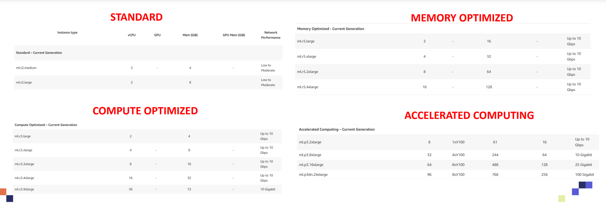

* Deployment/Inference
    * Inference instances are less computationally expensive therefore a compute instance would be sufficient.
        * C4
        * C5
        * P2 instances are intended for general-purpose GPU compute applications.
        * Amazon EC2 Inf1 instances are built from the ground up to support machine learning inference applications.
        * G4dn instances are designed to help accelerate machine learning inference and graphics-intensive workloads.
        * F1 instances offer customizable hardware acceleration with field programmable gate arrays (FPGAs).

### Amazon SageMaker Elastic Inference (EI):
* Only work with deep learning containers (TensorFlow and MXNet pre-built). 
* For other types of models you can use ONNX to convert them to MXNet.
* Inference of model requires less compute compared to training.
* Amazon Elastic Inference is designed to help reduce deep learning inference cost by 75%.
* EI could be used to speed up inference and reduce latency by adding an accelerator without the need of having a dedicated GPU (which will cost much more)
* Amazon Elastic inference allows you to attach low-cost GPU-powered acceleration to Amazon EC2 and SageMaker instances with no code changes.
* Amazon Elastic Inference supports TensorFlow, Apache MXNet.

### Enable Automatic Scaling
* Use CloudWatch to monitor and trigger scaling if capacity for an individually deployed production variant exceeds a threshold.
* Test the configuration before deploying.
* Amazon SageMaker offers an automatic scaling feature in which the number of instances could be adjusted in response to the workload. 
    * If the workload goes up, the number of instances is increased. 
    * If workload goes down, the number of instances is reduced.
* SageMaker users have to develop a scaling policy which in turn uses Amazon CloudWatch along with target values assigned by the user.
* Automatic scaling has the following components:
    * Permissions: those are required to perform automatic scaling actions.
    * AWS Identity and Access Management (IAM) role linked to an AWS service. 
    * Target metric: CloudWatch metric used by Amazon SageMaker automatic scaling to 
    decide when to scale.
    * Min/Max capacity: min/max number of instances used during scaling.
    * Cool down period: time required after a scale-in or scale-out activity completes before 
    another scale-out activity can start
* Automatically Scale Models
    https://docs.aws.amazon.com/sagemaker/latest/dg/endpoint-auto-scaling.html
    * Prerequisites
    * Configure model autoscaling with the console
    * Register a model
    * Define a scaling policy
    * Apply a scaling policy
    * Edit a scaling policy
    * Delete a scaling policy
    * Query Endpoint Autoscaling History
    * Update or delete endpoints that use automatic scaling
    * Load testing
    * Use AWS Cloud Formation to update autoscaling policies

### Batch Transform
* Inference pipelines can be leveraged here.
* While running batch transform, we recommended using the JSONLINES response type instead of JSON, if supported by the algorithm. 

## Invoke Endpoint

* The Amazon SageMaker model cannot be called directly using API Gateway, but needs a compute resource like Lambda in between to call the model. Or you can have an endpoint in between talking to the gateway.

## Deploy on IOT/ Hardware Agnostic/ Edge Devices

### Amazon SageMaker Neo (Optimize for Hardware):
* Amazon SageMaker Neo allows for Training the machine learning models once and running trained machine learning models anywhere on the edge or in the cloud.

* Used to train TensorFlow, Apache MXNet, PyTorch, ONNX, and XGBoost models once and optimize them for deployment on ARM, Intel, and Nvidia processors. (Before Neo, you will need to spend major man-hour efforts to deploy AI/ML Models on a specific hardware with specific compiler, memory, operating systems…etc).

* Compile Models
    * Prepare Model for Compilation
    * Compile Models: CLI
    * Compile Models: Console
    * Compile Models: SDK

* Cloud Instances
    * Supported Instance Types and Frameworks

    * Deploy a Model
        * Prerequisites
        * Deploy a Compiled Model Using SageMaker SDK
        * Deploy a Compiled Model Using Boto3
        * Deploy a Compiled Model Using the AWS CLI
        * Deploy a Compiled Model Using the Console

    * Request Inferences
        * Request Inferences from a Deployed Service (Amazon SageMaker SDK)
        * Request Inferences from a Deployed Service (Boto3)
        * Request Inferences from a Deployed Service (AWS CLI)

    * Inference Container Images

* Edge Devices
    * Supported Frameworks, Devices, Systems, and Architectures
        * Supported Frameworks
        * Supported Devices, Chip Architectures, and Systems
        * Tested Models
        * Deploy Models

    * Getting Started with Neo on Edge Devices
        * Step 1: Compile the Model
        * Step 2: Set Up Your Device
        * Step 3: Make Inferences on Your Device

### SageMaker Edge Manager

### AWS IoT Greengrass
* https://aws.amazon.com/greengrass/faqs/

## Multi-Model Endpoint

* Create a multi model endpoint
  * Multi model endpoint expects all your models to be in the same directory relatively speaking with same relative reference.
  
  * It is just like creating a normal endpoint, we're just going to specify that it supports multi-model
  
  * S3 model artefacts only gets copied on the end point once we invoke the endpoint for our use. It does not get copied at the time you create it.
  
  * Sagemaker manages which copied model is kept in memory of the endpoint and which ones it will fetch. So memory management of the EC2 instance (defining the size of it) is important.
  
  * Invoking Endpoints, Warm Start Invocation
    * While launching the endpoint service to customer, send some trial data to it, these trial request might take a bit more time to execute (fetching things and getting it ready). So that later the later queries are faster 
    
    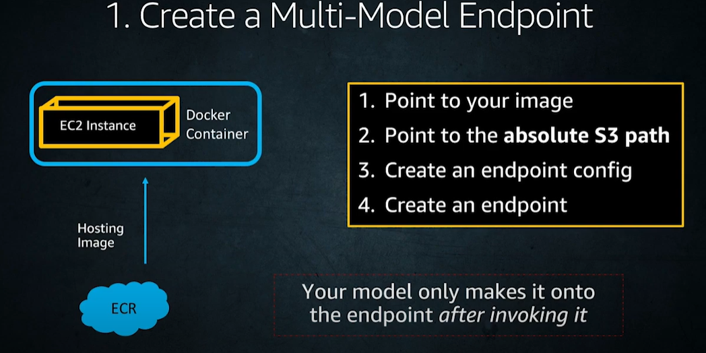
    
    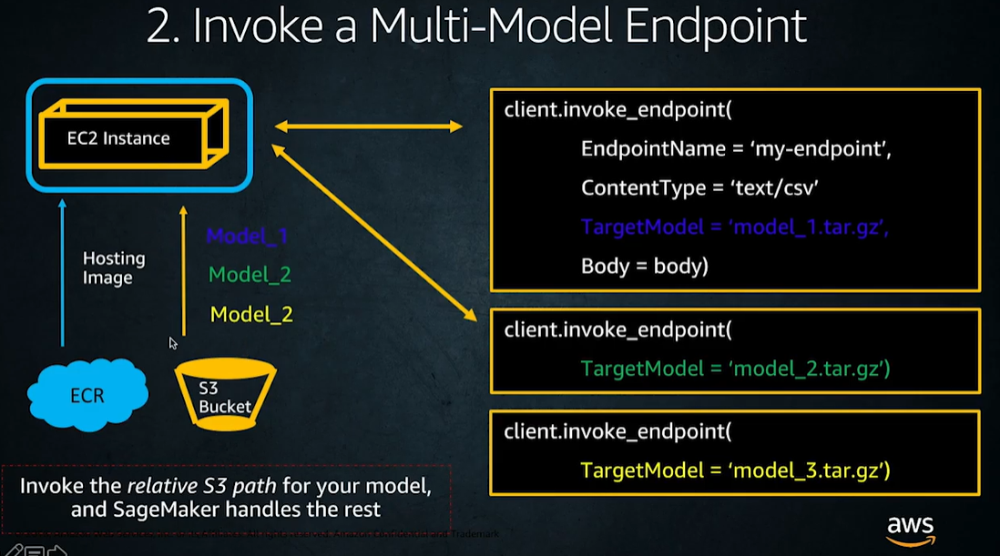

## Deploy Multi Container Endpoints
### Inference Pipelines
* SageMaker Pipelines
    * SageMaker Model might be composed of a “pipeline” which is a sequence of many containers that process data in a sequential fashion.
    * Built-in algorithms or custom-based algorithms in containers could be used to create a Pipeline in Sagemaker
* At max 5 containers can be integrated.

## Production/Canary Deployment
* Amazon SageMaker enables you to test multiple models or model versions behind the same endpoint using production variants.
* By using production variants, you can test ML models that have been trained using different datasets, trained using different algorithms and ML frameworks, or are deployed to different instance type, or any combination of all of these. 
* You can distribute endpoint invocation requests across multiple production variants by providing the traffic distribution for each variant, or you can invoke a specific variant directly for each request. 

### Test Model by specifying traffic distribution

To test multiple models by distributing traffic between them, specify the percentage of the traffic that gets routed to each model by specifying the weight for each production variant in the endpoint configuration. 

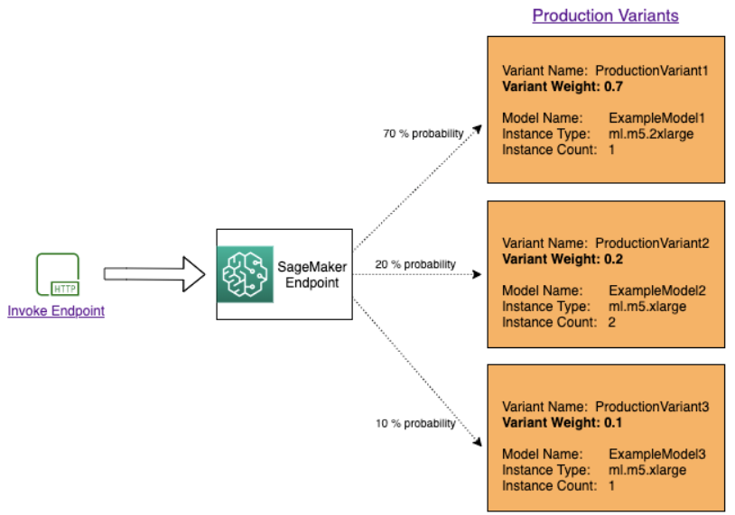

### Test models by invoking specific variants

To test multiple models by invoking specific models for each request, specify the specific version of the model you want to invoke by providing a value for the `TargetVariant` parameter when you call [InvokeEndpoint](https://docs.aws.amazon.com/sagemaker/latest/APIReference/API_runtime_InvokeEndpoint.html). SageMaker ensures that the request is processed by the production variant you specify. If you have already provided traffic distribution and specify a value for the `TargetVariant` parameter, the targeted routing overrides the random traffic distribution. The following diagram shows how this works in more detail.

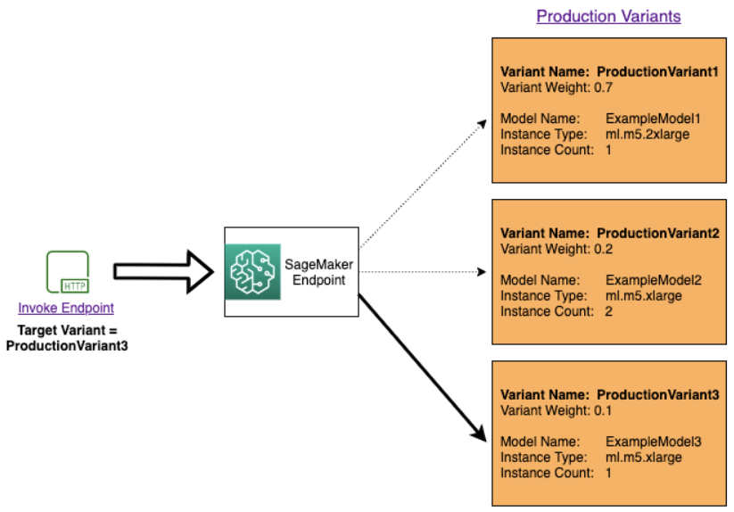

### Model A/B test example
* Step 1: Create and deploy models
  * First, we define where our models are located in Amazon S3. These locations are used when we deploy our models in subsequent steps:
  * We now create two production variants, each with its own different model and resource requirements (instance type and counts)
  * We set an initial_weight of 1 for both variants. This means that 50% of requests go to `Variant1`, and the remaining 50% of requests to `Variant2`. The sum of weights across both variants is 2 and each variant has weight assignment of 1. This means that each variant receives 1/2, or 50%, of the total traffic.
* Step 2: Invoke the deployed models
  * Now we send requests to this endpoint to get inferences in real time. We use both traffic distribution and direct targeting.
* Step 3: Evaluate model performance
  * To see which model version performs better, let's evaluate the accuracy, precision, recall, F1 score, and Receiver operating characteristic/Area under the curve for each variant.
* Step 4: Increase traffic to the best model
  * Now that we have determined that `Variant2` performs better than `Variant1`, we shift more traffic to it using `UpdateEndpointWeightsAndCapacities`.

## Deployment Best Practices
* Create robust endpoints when hosting your model. SageMaker endpoints can help protect your application from Availability Zone outages and instance failures. If an outage occurs or an instance fails, SageMaker automatically attempts to distribute your instances across Availability Zones. For this reason, we strongly recommended that you deploy multiple instances for each production endpoint.

* If you are using an Amazon Virtual Private Cloud (VPC), configure the VPC with at least two Subnets, each in a different Availability Zone. If an outage occurs or an instance fails, Amazon SageMaker automatically attempts to distribute your instances across Availability Zones.

## Model Monitor 

* Monitor Data Quality
    * Create a Baseline 
    * Statistics
    * CloudWatch Metrics
    * Violations

* Monitor Model Quality
    * Create a Model Quality Baseline
    * Schedule Model Quality Monitoring Jobs
    * Ingest Ground Truth Labels and Merge Them With Predictions
    * Model Quality Metrics
    * Model Quality CloudWatch Metrics
    * Model Validation
    * After the model is trained, its performance needs to be assessed.
    * There are generally two ways of validating the model, online validation and offline validation.
        * Online Validation: 
            * Measure model performance on new real data.
            * Model trained online are called production variants.
        * Offline: On historical data: Two type of offline validation
            * Validation using holdout set.
            * k-fold validation

* Monitor Bias Drift
    * Create a Bias Drift Baseline
    * Schedule Bias Drift Monitoring Jobs
    * Inspect Reports for Data Bias Drift

* Monitor Feature Attribution Drift
    * Create a SHAP Baseline
    * Schedule Feature Attribute Drift Monitoring Jobs
    * Inspect Reports for Feature Attribute Drift
    * Capture Data

* Schedule Monitoring Jobs
    * cron Scheduling

* Prebuilt Container

* Interpret Results

* Visualize Results

## Docker Container Image:
https://docs.aws.amazon.com/sagemaker/latest/dg/docker-containers.html

1. Prebuilt: Amazon SageMaker provides containers for its built-in algorithms and prebuilt Docker images for some of the most common machine learning frameworks, such as 
    * Apache MXNet
    * TensorFlow
    * PyTorch
    * and Chainer.
    * It also supports machine learning libraries such as scikit-learn and SparkML.

2. Adapting Your Own Docker Container to Work with SageMaker: You can adapt an existing Docker image to work with SageMaker.
    * There are two toolkits that allow you to bring your own container and adapt it to work with SageMaker:
        * SageMaker Training Toolkit
        * SageMaker Inference Toolkit
    * Individual Framework Libraries: In addition to the SageMaker Training Toolkit and SageMaker Inference Toolkit, SageMaker also provides toolkits specialized for TensorFlow, MXNet, PyTorch, and Chainer. 

3. Create a container with your own algorithms and models: If none of the existing SageMaker containers meet your needs and you don't have an existing container of your own, you may need to create a new Docker container.
    * Use Your Own Training Algorithms
    * Use Your Own Inference Code
        * To use your own inference code with a persistent endpoint to get one prediction at a time, use SageMaker hosting services.
        * To use your own inference code to get predictions for an entire dataset, use SageMaker batch transform.

## Workflows/Pipelines
* Use **Sagemaker pipelines**: An Amazon SageMaker Model Building Pipelines pipeline is a series of interconnected steps that is defined by a JSON pipeline definition. This pipeline definition encodes a pipeline using a directed acyclic graph (DAG).

* **Automate MLOps with SageMaker Projects: By using a SageMaker project**, teams of data scientists and developers can work in machine learning business problems. You can create a SageMaker project with a SageMaker provided MLOPs template that automates the model building and deployment pipelines using continuous integrations and continuous delivery (CI/CD). 

* **Amazon SageMaker ML Lineage Tracking: With SageMaker Lineage Tracking** data scientists and model builders can do the following:
    * Keep a running history of model discovery experiments.
    * Establish model governance by tracking model lineage artefacts for auditing and compliance verification.
    * Clone and rerun workflows to experiment with what-if scenarios while developing models.
    * Share a workflow that colleagues can reproduce and enhance (for example, while collaborating on solving a business problem).
    * Clone and rerun workflows with additional debugging or logging routines, or new input variations for troubleshooting issues in production models.

## Monitoring

* Amazon CloudWatch:
    * https://aws.amazon.com/cloudwatch/faqs/
    * Monitors your AWS resources and the applications that you run on AWS in real time. You can collect and track metrics, create customized dashboards, and set alarms that notify you or take actions when a specified metric reaches a threshold that you specify. For example, you can have CloudWatch track CPU usage or other metrics of your Amazon EC2 instances and automatically launch new instances when needed. For more information, see the Amazon CloudWatch User Guide.
    * These statistics are kept for 15 months
    * Amazon CloudWatch console limits the search to metrics that were updated in the last 2 weeks. 
    * Amazon CloudWatch Logs
        * https://aws.amazon.com/cloudwatch/faqs/
        * enables you to monitor, store, and access your log files from EC2 instances, AWS CloudTrail, and other sources. CloudWatch Logs can monitor information in the log files and notify you when certain thresholds are met. You can also archive your log data in highly durable storage. For more information, see the Amazon CloudWatch Logs User Guide.
    * CloudWatch Events
        * https://aws.amazon.com/cloudwatch/faqs/
        * delivers a near real-time stream of system events that describe changes in AWS resources. Create CloudWatch Events rules react to a status change in a SageMaker training, hyperparameter tuning, or batch transform job
* AWS CloudTrail:
    * https://aws.amazon.com/cloudtrail/faqs/
    * captures API calls and related events made by or on behalf of your AWS account and delivers the log files to an Amazon S3 bucket that you specify. You can identify which users and accounts called AWS, the source IP address from which the calls were made, and when the calls occurred. For more information, see the AWS CloudTrail User Guide.
* Automating Amazon SageMaker with Amazon EventBridge
    * https://aws.amazon.com/eventbridge/faqs/

    * Amazon EventBridge monitors status change events in Amazon SageMaker. EventBridge enables you to automate SageMaker and respond automatically to events such as a training job status change or endpoint status change. Events from SageMaker are delivered to EventBridge in near real time.

    * Some examples of the actions that can be automatically triggered include the following:
        * Invoking an AWS Lambda function
        * Invoking Amazon EC2 Run Command
        * Relaying the event to Amazon Kinesis Data Streams
        * Activating an AWS Step Functions state machine
        * Notifying an Amazon SNS topic or an AWS SMS queue

## Security and Encryption

### General Security

#### Who is responsible for security?
* Shared security Model

    

    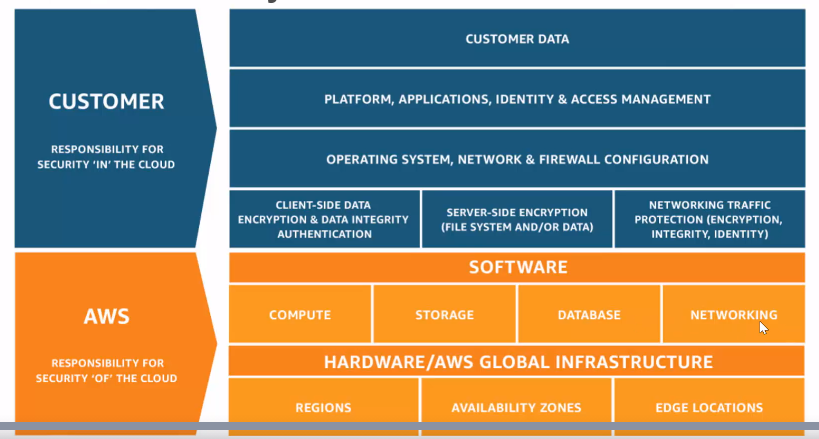

    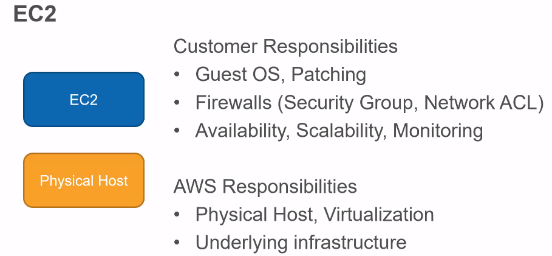

    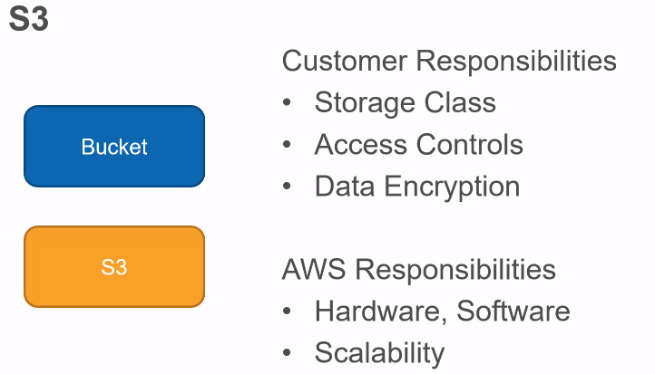
#### Who requires access (types of entities) ?

* Users to use resources
    * Delegation: Managing access for entities which are created/signed-up on aws is called delegation
        * Single Account : Root and Users
        * Multi Account (within aws): Root and users
    * Federation: When allowing access to entities not registered through/on aws. These are identities which are outside aws.
        * Corporate Identity: Microsoft Azure Account, IBM Cloud Account, 
        * Internet Identity: For web and mobile apps. Users who sign up for your created service

* Resources to connect with other resources and services: Eg EC2/Container/AWS Service/On Premise systems  trying to connect to S3/Database, 

    AWS works on the principle of zero trust, for connecting to other resources you have to supply your identity every time.

    * Authentication: caller needs to prove identity 
    * Authorization: caller needs permission

### SageMaker Policies

* Administrators can use AWS JSON policies to specify who has access to what. That is, which **principal** can perform **actions** on what **resources**, and under what **conditions**.

* **SageMaker does not support resource-based policies.**
* **SageMaker doesn't support service-linked roles.**
* **SageMaker supports service roles.**

* **Use tags and IAM roles to grant access.**
* **Sagemaker supports Temporary Roles**: You can use temporary credentials to sign in with federation, assume an IAM role, or to assume a cross-account role. You obtain temporary security credentials by calling AWS STS API operations such as [AssumeRole](https://docs.aws.amazon.com/STS/latest/APIReference/API_AssumeRole.html) or [GetFederationToken](https://docs.aws.amazon.com/STS/latest/APIReference/API_GetFederationToken.html).
* **SageMaker does not support specifying resource ARNs in a policy.**

----------------------------------------

### How do these entities connect to aws?

* For Creating and Authenticating the identity of users in AWS
  
    * There are two types of long term authentication options, for these you can choose to optionally add MFA (Multi Factor Authentication):
        * Using Management Console
            * Passwords
        * Using Command Line
            * Access Keys/ Secret access keys
    
* For defining a policy (the scope) users have access to
    * There are no default permission given to users.
    * You can choose to:
        * Identity Based Policy: Attach Policies to users

          * Effect: Allow or not
          * Action: Which actions can the user perform (these are the RESTful API calls the user is allowed to run)
          * Resource: Allow these actions to be executed on these set of resources.

          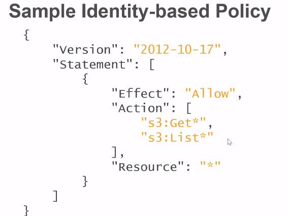

        * Resource Based Policy: Attach Policies to resources
          * These Policies are useful when supporting multi-account model
          * In addition to the above fields for identity based policy, for resource based policies you also have to add the users who will have access to the resource
          * Principal: We have added two IAM roles to have permission to them

          * REMEMBER : GROUPS ARE NOT ALLOWED TO BE SPECFIED WHILE DEFINING POLICIES. IT HAS TO BE INDIVIDUAL USERS

            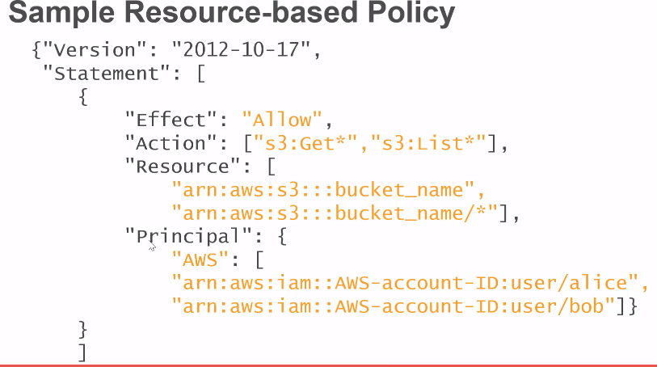

          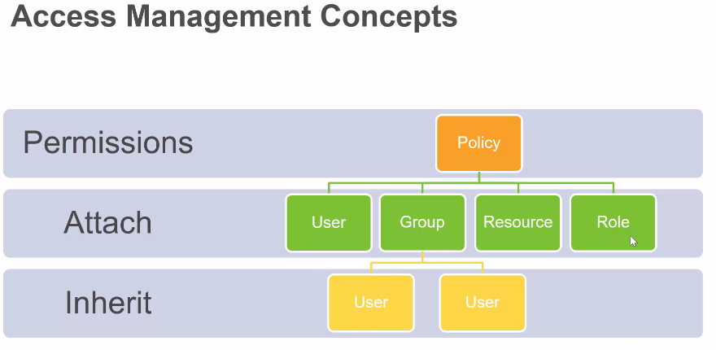
          
          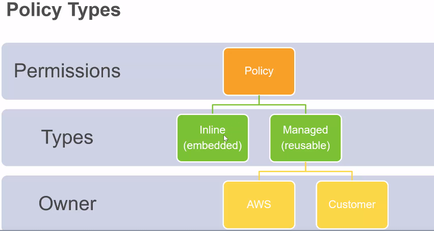

    * Use IAM
    
    * MFA (Multi Factor Authentication)
    
    * SSL/TLS while connecting to anything
    
    * Cloud Trail to log activity
    
    * Use encryption
    
    * Be careful with PII (Personal Identifiable Information). User services like Amazon Macie which will help with discovering personal data stored in S3.

* Experiments
    * Sagemaker Training Jobs by default run in a VPC.
    * If you want to run it in a private-VPC then sagemaker will require access to s3
    * To provide access to s3:
        * Setup a s3 vpc endpoint
        * Apply custom endpoint policies and s3 bucket policies to keep this secure.
    * Sagemaker notebooks are internet enabled by default.
        *  if you have disable internet access from your notebooks you're gonna have to set a new separate endpoint with private link or NAT gateway enabled to make sure that you can get through your VPC to get the outbound connections that.
    * Training and Inference containers are also internet enabled by default.
        * S3 will again be inaccessible

you need for training and hosting to work.

### Access Control
* SageMaker app permissions: The run-as user for the JupyterServer app is sagemaker-user (1000) by default. This user has sudo permissions to enable the installation of dependencies such as yum packages.

* User remapping: SageMaker performs user-remapping to map a user inside the container to a user on the host instance outside the container.

* Custom image permissions: Customers can bring their own custom SageMaker images.The customer can implement fine grained permission control inside the image.

* Container isolation: Docker keeps a list of default capabilities that the container can use. SageMaker doesn’t add additional capabilities

* EBS access: An Amazon Elastic Block Store (Amazon EBS) volume is attached to the host instance and shared across all images. It's used for the root volume of the notebooks and stores temporary data that's generated inside the container. The storage isn't persisted when the instance running the notebooks is deleted. The root user inside the container can't access the EBS volume.

* By default, when you create a notebook instance, users that log into that notebook instance have root access. If you don't want users to have root access to a notebook instance, when you call CreateNotebookInstance or UpdateNotebookInstance operations, set the RootAccess field to Disabled.

### Data Protection
* Protect Data at Rest Using Encryption:
    * Server side encryption is provided by aws.
    * AWS KMS
        * To protect your Amazon SageMaker Studio notebooks and SageMaker notebook instances, along with your model-building data and model artifacts, SageMaker uses the AWS Key Management Service (AWS KMS) to encrypt the notebooks and data. For both volumes (EBS and EFS) with an AWS managed customer master key (CMK) by default.
        * Sensitive data that needs to be encrypted with a KMS key for compliance reasons should be stored in the ML storage volume or in Amazon S3, both of which can be encrypted using a KMS key you specify.
        * Accepted by sagemaker notebooks and all jobs
        * Training, tuning, batch transform
    * S3
        * uses tags and iam policies, etc. see s3 security
        * also uses kms

* Protecting Data in Transit with Encryption
    * TLS/SSL
    * IAM roles can be assigned to sagemaker to give it access to particular resources
    * Distributed Training (only weights are transferred not the training data)
        * By default, Amazon SageMaker runs training jobs in an Amazon Virtual Private Cloud (Amazon VPC) to help keep your data secure. You can add another level of security to protect your training containers and data by configuring a private VPC. 
        * Inter node training/inter-container (during distributed deep learning training jobs) can also be encrypted by choosing the option to encrypt it via console. This will impact the speed of training.
        * The training time for most SageMaker built-in algorithms, such as XGBoost, DeepAR, and linear learner, typically aren't affected.
        * Enable Inter Container Traffic encryption (API)
            * Add inboud/outbound rules to private VPC's security group
                * UDP Protocol:  Port range 500
                * ESP 50 Protocol: Port range N/A
            * While creating training job set the value of the **EnableInterContainerTrafficEncryption=True**
        * OR
        * Enable Inter Container Traffic encryption using (Console)

* Key Management
    * Customers can specify AWS KMS keys, including bring your own keys (BYOK), to use for envelope encryption with Amazon S3 input/output buckets and machine learning (ML) Amazon EBS volumes.

* Internetwork Traffic Privacy

### Identity and Access Management

* See the **General Security** section above on different types of polices 
* Specific to sagemaker

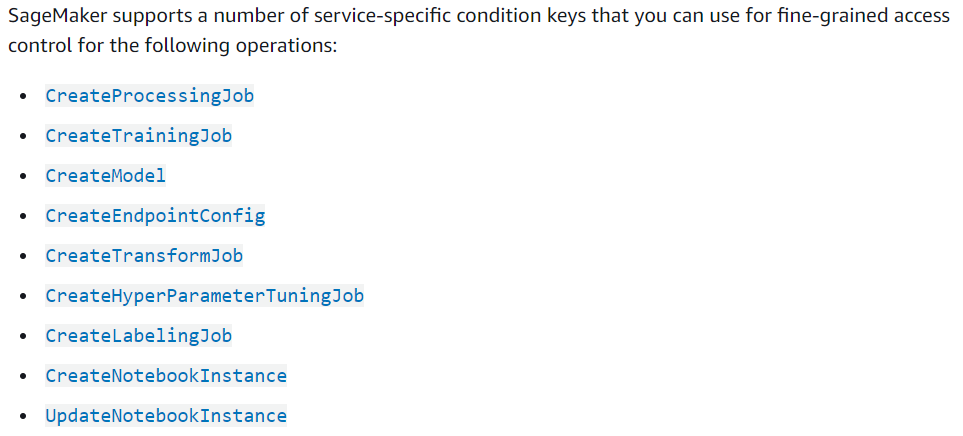

### Logging and Monitoring
* You can monitor Amazon SageMaker using Amazon CloudWatch, which collects raw data and processes it into readable, near real-time metrics. These statistics are kept for 15 months
* You can also set alarms that watch for certain thresholds and send notifications or take actions when those thresholds are met.
* **Amazon ** Logs enables you to monitor, store, and access your log files from Amazon EC2 instances
* **CloudWatch Logs** can monitor information in the log files and notify you when certain thresholds are met. You can also archive your log data in highly durable storage.
* **AWS CloudTrail** provides a record of actions taken by a user, role, or an AWS service in SageMaker. Using the information collected by CloudTrail, you can determine the request that was made to SageMaker, the IP address from which the request was made, who made the request, when it was made, and additional details.

### Compliance Validation
* Third-party auditors assess the security and compliance of Amazon SageMaker as part of multiple AWS compliance programs. These include SOC, PCI, FedRAMP, HIPAA, and others.

### Resilience
* The AWS global infrastructure is built around AWS Regions and Availability Zones. AWS Regions provide multiple physically separated and isolated Availability Zones, which are connected with low-latency, high-throughput, and highly redundant networking. 

### Infrastructure Security

#### Connect Studio Notebook in a VPC

* By default, SageMaker Studio and Sagemaker Notebooks are internet enabled and provides a network interface that allows communication with the internet through a VPC managed by SageMaker. Traffic to AWS services like Amazon S3 and CloudWatch goes through an internet gateway as does traffic that accesses the SageMaker API and SageMaker runtime.

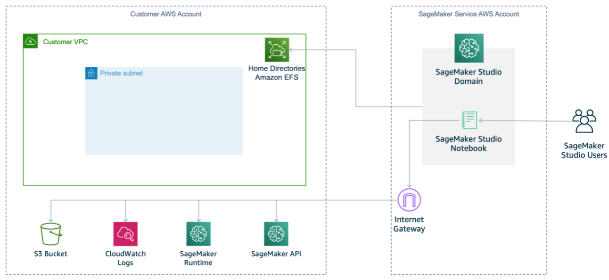

* To disable direct internet access, you can specify the VPC only network access type when you onboard to Studio or call the CreateDomain API.
    * One or more security groups with inbound and outbound rules that together allow the following traffic:
        * NFS traffic over TCP on port 2049 between the domain and the Amazon EFS volume.
        * TCP traffic within the security group. This is required for connectivity between the JupyterServer app and the KernelGateway apps.
    * If you want to allow internet access, you must use NAT gateway with access to internet (for example, via an internet gateway).
    * If you don't want to allow internet access, you must create interface VPC endpoints (AWS PrivateLink) to access the following:
        * The SageMaker API and SageMaker runtime. This is required to run Studio notebooks and to train and host models.
        * Amazon S3 and other AWS services you require.
        * If you're using SageMaker Projects in SageMaker Studio without internet access, you need a VPC endpoint for Service Catalog.
        * You must associate the security groups for your VPC with these endpoints.
    * While performing training:
        * Specify **VpcConfig** while submitting your training job

  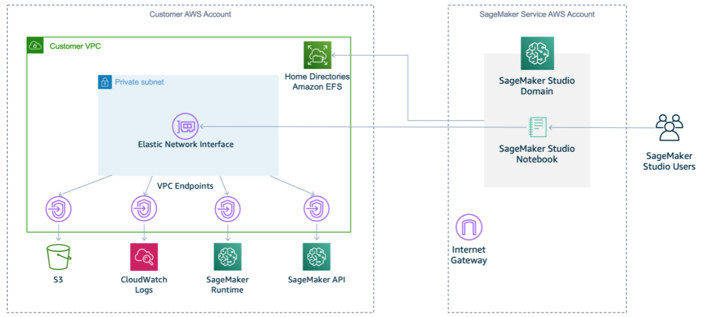