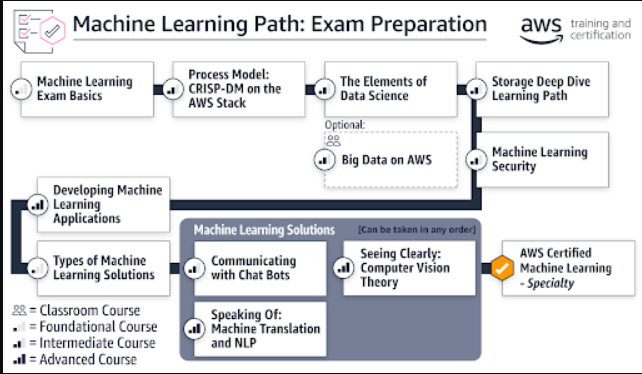
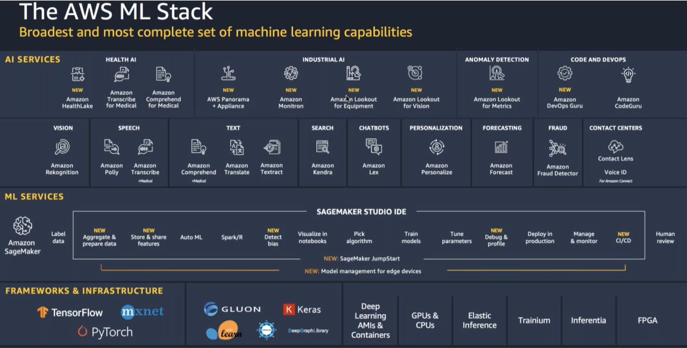

# Syllabus

* [Domain 1 : Data Engineering](Domain_1/dataEngineering.md)

* [Domain 2 : EDA](Domain_2/eda.md)

* [Domain 3 : Modeling](Domain_3/modeling.md)

* [Domain 4 : Machine Learning Implementation and Operations](Domain_4/mlops.md)

* [Exam Readiness](Exam_Guidelines/exam.md)

* [Practice Questions](Practice_Questions/practiceQuestions.md)


## Contribute

### Tips

[Markdown Cheatsheet](https://github.com/adam-p/markdown-here/wiki/Markdown-Cheatsheet#links)
```markdown 
* Headings and Sub-Headings

    # YOUR-H1-HEADING

    ## YOUR-H2-HEADING

    ...

    ### YOUR-H5-HEADING


* To Add Links
    
    [YOUR-LINK-LABEL](http://YOUR-LINK)             or you can use relative links as well

* To Add Image

                or you can use relative links as well

```

## Exam Overview



